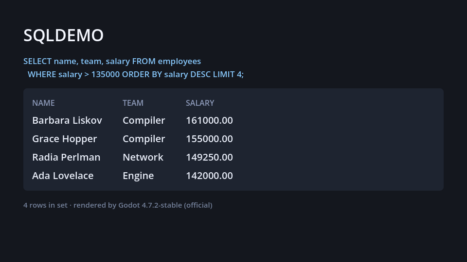

# SQLDEMO

A small [Godot 4](https://godotengine.org) project that runs a SQL-flavoured query
over an in-memory table, prints the result like a SQL shell would, and draws the
same rows on screen. It runs without an editor and without a display, so it works
in CI or over SSH.



## Running it

Godot 4.4 or newer (developed against 4.7.2-stable). Point `GODOT` at the binary if it is not on your `PATH`:

```sh
tools/run.sh                # prints the result, then exits (headless)
tools/run.sh --screenshot   # renders off-screen, saves out/sqldemo.png
```

```
SQLDEMO — Godot 4.7.2-stable (official) (headless)

SELECT name, team, salary FROM employees
  WHERE salary > 135000 ORDER BY salary DESC LIMIT 4;

+----------------+----------+-----------+
| name           | team     | salary    |
+----------------+----------+-----------+
| Barbara Liskov | Compiler | 161000.00 |
| Grace Hopper   | Compiler | 155000.00 |
| Radia Perlman  | Network  | 149250.00 |
| Ada Lovelace   | Engine   | 142000.00 |
+----------------+----------+-----------+
4 rows in set
```

The screenshot mode needs `xvfb-run` and a software OpenGL driver (Mesa's
llvmpipe is enough). Godot's `--headless` mode uses a dummy renderer that never
produces a frame, so capturing one means rendering into a virtual X display
instead — that is the only difference between the two modes.

## Layout

| Path | What it does |
| --- | --- |
| `scenes/main.tscn` | The scene Godot boots into. |
| `scripts/main.gd` | Runs the query, prints it, builds the UI, saves the screenshot. |
| `scripts/query.gd` | `Query`: a chainable `where` / `order_by` / `limit` / `select` over an array of rows. |
| `tools/run.sh` | Headless and screenshot entry points. |

Command-line flags are passed after a bare `--`:

```sh
godot --headless --path . -- --quit
godot --path . --rendering-driver opengl3 -- --screenshot=out/sqldemo.png
```

## Notes

`scripts/query.gd` declares `class_name Query`, and Godot only registers
`class_name` scripts once the project has been imported. A fresh checkout
therefore needs one `godot --headless --path . --import` pass before the project
will run; `tools/run.sh` does this for you.
