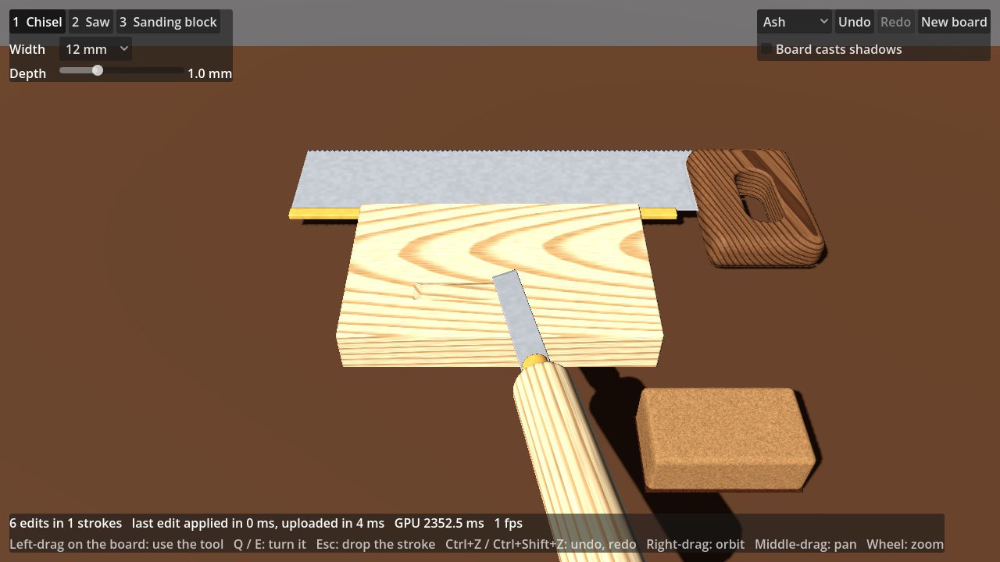

# Object Builder — SDF engine

The engine for a crafting game where players make working objects — a pickaxe is a
steel head, an ash handle and a wedge — from parts shaped by real processes and then
joined. Every part is a **signed distance field**: an analytic base shape plus an ordered
list of edits (tool strokes, fillets, inlays, paint), each combined with a chosen blend
mode. The full design is in the approved plan; this README covers what exists today.

## The workshop

Open `game/` in Godot 4.7 and press F5 (or run `godot --path game`). A board lies on a
bench with three hand tools beside it: a chisel, a back saw and a sanding block. Every one
is an SDF body, built by the engine in steel, brass, ash, walnut, cork and abrasive paper.

1. **Pick up a tool.** Click it on the bench, or press 1 / 2 / 3.
2. **Point at the board.** The tool floats where it will engage, and an outline marks what
   it will touch: the chisel's edge and its push direction, the saw's line, the block's
   face.
3. **Hold the left button and drag.** The cut follows live:
   - **Chisel:** pares along the drag, at the width and depth set in the panel. It ramps
     in at its approach angle and lifts out when you let go. It cannot un-cut: pulling
     back does nothing.
   - **Saw:** stroke it back and forth along its line. Every millimetre of travel deepens
     the kerf by the feed, until it is through the board.
   - **Sanding block:** takes the surface down wherever it rubs, faster at coarser grits.
     Being a flat block, it flattens: high spots and edges go first, and the edges of the
     patch feather out.

Other controls:
- Q / E turn the tool; Esc drops the stroke in progress.
- Ctrl+Z / Ctrl+Shift+Z undo and redo, without limit.
- Right-drag orbits, middle-drag pans, the wheel zooms.
- The panel switches the wood (ash, oak, walnut), starts a new board, and lets the board
  cast shadows.
- *Preview strokes on the GPU* (on by default): the shader draws the cut while you drag,
  and the board applies it once, when you let go. Turned off, every move is applied as it
  happens, for comparison.
- The status line shows how long the last edit took to apply and upload, how many edits
  the shader is previewing, and the GPU frame time.

| | |
| --- | --- |
|  |  |
|  |  |

(Rendered here on software OpenGL, at about a frame a second; the status line reads the
GPU time on real hardware.)

**How it works:**
- A tool in use is a *stroke* (`native/src/core/tools/`). It turns the tool's motion into
  edits of the same shapes the tool's model is built from, and gives the cut so far merged
  into as few edits as it takes: the chisel's ramp and flat run, the saw's kerf, the
  block's pass.
- **While the tool moves, the shader draws the stroke.** `SdfBody` hands the merged edits
  to the Live shader as uniforms (the *overlay*, up to 16 edits), and the shader cuts them
  into the field wherever it samples it: the march, the settling steps, the normals and
  the ambient occlusion. Moving a tool costs no CPU work at all, and the cut keeps up with
  the frame rate.
  - Tools only cut, and a cut only ever raises the field, so empty cells stay empty and are
    still skipped whole.
  - A cut applied on top of the field is exactly the body with that edit appended. Where it
    opens up a solid cell, which has no brick, the shader uses the cell's stored material.
  - Normals difference the cut as closely as an exact cell's tape, so its edges stay crisp.
    Bricks keep their taps half a voxel apart, because hardware filtering resolves only
    1/256 of a voxel.
- **When the tool lifts off, the stroke is applied once:** the merged edits, plus the
  chisel's lift-out, go to the body's `EditSession` (`native/src/core/edit/`). That session
  keeps unlimited undo and updates the octree and ADF incrementally; cells that pruning
  shows no changed edit reaches keep their bricks.
  - `SdfBody` applies it on a worker thread, then uploads only the brick layers that
    changed.
  - The stroke leaves the overlay in the same frame as that upload, so nothing pops.
  - Commands that arrive while an update runs are folded together, so a slow update never
    builds a backlog.
  - `game/tests/stroke_preview` renders each tool's preview and its commit and diffs them.
    The mean difference is under 0.1 / 255, and 0.013% of pixels or fewer differ
    noticeably.
- **With the preview off,** each move is applied as it happens. Cuts that only grow keep
  their newest piece open and re-cut just that as it grows. The chisel's 10 mm lengths of
  run and the saw's 1 mm slices of kerf are then left behind, so an update touches only
  what moved. Those pieces overlap generously: inside a union of cuts the field is only a
  bound, and a thin overlap leaves a seam whose value is smaller than the hit epsilon,
  which the raymarcher would draw as a wall. The merged edits have no such seams.

`sdf_bench tools` times both ways on the workshop board (4 shared cores):

| Tool at work | Applied as it moves | Previewed, applied on release |
| --- | --- | --- |
| chisel, 12 mm wide, 1.5 mm deep, pushed 60 mm | 29 updates of 19 ms (0.56 s in all), 8 edits | 56 ms once, 3 edits |
| saw, 12 mm deep in 30 strokes | 30 updates of 56 ms (1.7 s), 10 edits | 97 ms once, 1 edit |
| sanding block, rubbed over the board | 25 updates of 145 ms (3.6 s), 1 edit | 136 ms once, 1 edit |

Applied as it moves, the cut lags the tool by an update, and a sanding update re-samples
everything the block has covered, as well as the previous pass. Previewed, the cut is
there in the same frame, and the CPU works once per stroke.

## Layout

| Path | What it is |
| --- | --- |
| `native/src/core/shared/*.glsl` | The SDF formulas — primitives, tool cross-sections, swept strokes, blend modes, materials. Written in a subset that compiles **both as C++ and as Godot shader code**, so the CPU evaluator and the GPU raymarcher run the same maths. Edit these only. |
| `native/src/core/glsl_compat.h` | Just enough GLSL (`vec3`, `mix`, `clamp`, …) in C++ to compile the shared files. |
| `native/src/core/body/` | `Body`, `Edit`, `Primitive`: the per-part source of truth, bounds and Lipschitz bounds; the material table. |
| `native/src/core/compile/` | The octree: per-cell pruned edit lists ("tapes") that keep per-query cost independent of edit count. |
| `native/src/core/adf/` | The adaptive distance field: the Live display cache (sampled bricks, exact cells at creases). |
| `native/src/core/eval/` | The CPU reference renderer (ground truth for every later GPU path) and exact ray queries. |
| `native/src/core/tools/` | The hand tools: each one's model and the cuts it makes, and strokes that turn a tool's motion into edits. |
| `native/src/core/edit/` | `EditSession`: a body's edits with the stroke in progress and undo / redo, its octree and ADF kept up to date incrementally. |
| `native/src/demo/`, `native/tools/` | Demo scenes; `sdf_gallery` (renders the galleries), `sdf_render` (renders any demo, diffs against another image) and `sdf_bench` (octree scaling). |
| `native/src/godot/` | The GDExtension: `SdfBody`, a node that raymarches a body live. |
| `native/tests/` | Property tests for the core and golden-image tests. No Godot needed. |
| `game/` | The Godot 4.7 project. `game/workshop/` is the workshop (the main scene); `game/shaders/sdf/` holds byte-identical copies of the shared files plus `sdf_live.gdshader`; `game/bench/` the decision-gate benchmark. |
| `extern/godot-cpp/` | godot-cpp 10.0.0 (submodule), built against the Godot 4.7 API. |
| `tools/` | `sync_shaders.sh`, `run.sh` (headless / Xvfb scene runner), `test_godot.sh`, `parity.sh`. |


## Blend modes

The primitive decides the surface; the blend mode decides the edge where two surfaces meet.
Every mode has compact support — beyond its radius it is exactly the hard result — so an
edit only reshapes the field near its own primitive.

| Mode | Edge | Lipschitz |
| --- | --- | --- |
| `Hard` | crisp arris | 1 |
| `Chamfer` | flat bevel, optionally asymmetric (`r` onto one surface, `r2` onto the other) | √2 |
| `Round` | circular fillet, unchanged outside it | √2 |
| `Smooth`, `SmoothC2` | organic polynomial blend (C1 / C2); mixes materials | 1 |
| `Profile` | router-style edge profiles: arc concave, arc convex, ogee | √2 |

Operators: union, subtract, intersect, plus engrave / groove / tongue along a guide
surface, and paint (material only). Tool strokes sweep a flat, V or gouge cross-section
along a segment or a quadratic Bezier.

## Materials

Materials are evaluated in each part's own space, relative to where it sat in the log or
block, so a cut reveals the figure that was always inside it. Smooth blends mix materials;
hard ones keep a crisp boundary on one continuous surface.


These are rendered by the CPU reference renderer (`native/src/core/eval`): sphere tracing
with Lipschitz-scaled steps and a pixel-footprint hit epsilon, SDF soft shadows and SDF
ambient occlusion. It is slow on purpose — it is the ground truth the GPU path is
diffed against. `Body::sample` already skips, per point, every edit whose bounding box
is at least `|d| + influence` away, which provably never changes the result's sign.

## Scaling to many edits: the octree

A carving session is thousands of strokes; a stone job, tens of thousands of chips.
Evaluating every edit at every point would make each query cost O(edits). Each body is
therefore compiled into an adaptive octree whose cells hold a pruned **tape**: only the
edits that can shape the surface inside that cell, in order.

**The contract:** inside every cell, a tape's field has exactly the body's sign, and its
exact values within `value_margin` (1 mm) of the surface — enough for hits, normals and
shadows. Further out it is a valid distance bound for that cell, so tracing clamps every
step at the cell's exit and skips cells proven empty.

Edits are dropped from a cell by rules that each preserve that contract:

- **Reach.** Its bounds, grown by its own blend reach, by the widest reach of any *later*
  edit that reads values in the cell, and by the value margin, miss the cell. (Hard min /
  max only depend on their operands' signs, but a later blend reads actual values, which a
  dropped neighbour could otherwise have fed.)
- **Interval arithmetic.** The field's range over the cell is tracked through every op's
  own rules. An edit that provably changes nothing is dropped; one whose primitive alone
  defines the whole cell *resets* the tape — unless an earlier union or paint put a
  different material there, which a cut must still expose.
- **Supersession.** A hard cut provably contained, throughout the cell, by a later hard
  cut is dead: finishing cuts supersede roughing cuts. Monotone blends in between widen the
  margin the later cut must win by; profiles, guide ops and material changes stop the search.

Cells split while their tape exceeds a budget, but never below half the smallest feature
in the tape: chipped stone does not need the sub-millimetre cells a fine V-tool line does.
Curved strokes tighter than their tool can follow are refused by `Body::add` — they are
not cuts a real tool makes, and their distance bound degrades too far.

`sdf_bench`, a granite block roughed out by percussive chips (4 cores):

| Chips | Build | Add one chip | Surface cells | Mean tape | Memory | vs full edit list |
| --- | --- | --- | --- | --- | --- | --- |
| 1,000 | 0.003 s | 7 µs | 820 | 4.3 | < 1 MB | 75× faster |
| 10,000 | 0.16 s | 30 µs | 55 k | 7.6 | 3.5 MB | 380× faster |
| 100,000 | 10.7 s | 1.0 ms | 1.0 M | 14.7 | 183 MB | 965× faster |

The 100k case is heavy mostly because a 0.4 m² worked face at millimetre detail simply has
that many cells; consolidating old chips into a sampled base field (planned alongside
forging) is what will bound it for very long jobs.

## In Godot: the Live path

`SdfBody` (a `MeshInstance3D`) compiles its body into the octree and an **adaptive distance
field** (ADF, below), and flattens both into data textures. A proxy box around the body
runs the Live shader (`sdf_live.gdshaderinc`), which sphere-traces each pixel in the body's
own millimetres. It writes the true hit's depth, normal and position (`DEPTH`, `NORMAL`,
`LIGHT_VERTEX`), so Godot lights and composites it like any mesh. Adding a stroke updates
the touched cells and bricks and uploads only what changed; nothing is meshed.

**The ADF.** Interpreting edit tapes per pixel costs the tape's length in texel fetches on
every frame, for edits that never change. So each edit is evaluated once per affected
voxel instead, when it is made:
- The octree continues into bricks of 8³ half-float distance samples along the surface.
- Each cell is refined until trilinear reconstruction is within 5 µm of the exact field
  near the surface. Planes are exact under trilinear filtering, so flat and gently curved
  faces get coarse bricks (up to 1 mm between samples).
- Creases would need ever finer bricks, so a crease cell ≤ 1 mm becomes an *exact* cell. Rays
  march on its brick while they are further from the surface than the brick's error band,
  then evaluate its own tape: the octree tape pruned again to that small cell, which leaves
  only the 2–3 edits forming the crease. Hits, normals and materials there are exact. The
  band is measured when the cell is built (twice the worst brick-vs-tape difference near
  the surface), some 30× narrower than the worst case L · voxel · √3, so rays reach the
  tape later and need fewer tape steps.
- Lookups start from a 64³ grid over the root cube that names each block's node, a few
  levels above its leaves, instead of descending a dozen levels from the root.
- Normals come from the hit's own leaf: four taps on its brick, or one pass over its tape
  for all four taps in an exact cell. The tape interpreter is inlined wherever the shader
  calls it, so it is called from three places only.
- Bricks live in a `Texture2DArray` and are read with hardware filtering. An edit
  re-samples the cells it reaches, reuses the rest (slots and all) and uploads only the
  layers that changed. "Reaches" is decided by pruning, not by the edit's bounding box: a
  long curved stroke's box holds several times more cells than its groove touches.
- The exact field stays the truth: bricks are a display cache, like a baked mesh.
  `live_source = EXACT` raymarches the tapes alone, for comparison.

`sdf_bench adf` (4 shared cores; per stroke before the pruning test in parentheses, same
machine):

| Body | Edits | Build | Memory | Exact cells | Per stroke |
| --- | --- | --- | --- | --- | --- |
| carved panel | 52 | 0.63 s | 16.5 MB | 4,904 | 28 ms (44) |
| fluted ball | 6 | 0.11 s | 5.5 MB | 0 | 6 ms (7) |
| random session | 227 | 3.0 s | 29 MB | 14,892 | 51 ms (108) |
| random session | 1,495 | 18 s | 51 MB | 25,260 | 182 ms (586) |

Nearly all of that is evaluating primitives at brick samples (callgrind: 80%), a quarter
of it in the Bézier strokes' cubic solve.

The shader is bound by texture fetches, as Claybook's SDF tracer was. `sdf_bench count`
replays it on the CPU for the benchmark's views and counts texel fetches per pixel:

| View | Exact tapes (E3b) | ADF (E3d) | ADF, measured bands and grid (E3e) |
| --- | --- | --- | --- |
| panel filling the screen | ~1070 | 129 | 64 |
| close-up of the rosette | ~1670 | 262 | 128 |
| 2000 random strokes | ~15,000 | 765 | 335 |


**Parity.** `tools/parity.sh` renders every demo through Godot and diffs it pixel by pixel,
from the same camera, against two CPU renders:
- the formula field (every edit, in order, no octree): the ground truth;
- the CPU tracing the same source (the ADF), the same algorithm, so any mismatch is a
  shader bug.

Normals check geometry and unlit albedo checks materials. The 25 cases are the 8 blend
modes, 6 material scenes, the carved panel, the fluted ball and a 300-stroke session, at
1280x720.
- **Against the ground truth:** the mean channel difference is at most 0.34 / 255, and at
  most 0.16% of pixels differ by more than 24 / 255. Those are single pixels on silhouettes
  and creases, where a pixel centre falls on one side of the edge or the other.
- **Against the CPU ADF:** at most 0.007% of pixels differ.

The exact Live path (`PARITY_ARGS=--live-source=exact`) matched the ground truth within
0.23 / 255 and 0.05%. Results are identical with the node scaled to a metre world
(scale 0.001).

What was checked in Godot (Compatibility renderer, the only one without a GPU):

| Check | Result |
| --- | --- |
| Depth composition with meshes | exact: meshes pushed into a body are cut at its surface |
| Casting shadows | works: the shadow pass runs the raymarch and takes its depth (opt-in, see below) |
| Receiving shadows | Forward+ / Mobile look shadows up per fragment at `LIGHT_VERTEX` (from Godot's source, to confirm on hardware); Compatibility computes shadow coordinates per vertex, on the proxy box, so there Live bodies receive no shadow-map shadows |
| Orthographic cameras (directional shadow passes are orthographic) | works |
| Metre-scaled world | works, parity unchanged |

**The decision gate** (plan §4) runs `game/bench/live_bench.tscn` on real hardware. The
first run (RTX 3060 Ti, Forward+, 1280x720) failed it clearly:

| Scenario | GPU median | Target (at 1080p) |
| --- | --- | --- |
| panel filling the screen | 19.1 ms | 6 ms |
| close-up of the rosette | 40.7 ms | 6 ms |
| 2000 random strokes | 283.9 ms | 6 ms |
| three bodies | 21.6 ms | 8 ms |

Where the time went (counted by replaying the shader on the CPU, and timed with Mesa):
- raymarching again in every shadow pass: about two thirds of the frame;
- Forward+ running the shader twice (depth prepass and colour pass);
- evaluations after the hit (refine, normal, AO): about 75% of the rest;
- about 8 texel fetches per edit in each evaluation.

The measured times track the fetch count (close-up ≈ 1.6× the panel's, 2000 strokes ≈ 14×).

What changed:
- Live bodies no longer cast shadows by raymarching unless `live_shadows` is on; the
  baked mesh (E4) will cast them. When they do, the caster marches bricks only: a shadow
  map cannot resolve an exact cell's error band.
- They draw in one pass (`sdf_live_single.gdshader`: the transparent pipeline, which skips
  the depth prepass but still writes depth). This also fixed speckle on Forward+: after its
  prepass, Forward+ redraws opaque materials with an exact-equality depth test, and a
  raymarched depth recomputed by a separately compiled shader variant misses it on some
  pixels. With `live_shadows` on, an internal shadows-only child runs the opaque variant
  in shadow passes, where no such test applies.
- The ray and the post-hit taps stay in their octree cell.
- Rays end at the opaque scene's depth (read in the single pass), so the parts of a body
  hidden behind meshes cost nothing.
- Edit, node and tape records are packed tighter.

Parity is unchanged. On Mesa that is 5.5× faster, and rendering 3D at half resolution
another 3.4×. The ADF (above) then removed the tape-length term from the per-pixel cost.

Run it after building (below):

```sh
godot --path game res://bench/live_bench.tscn                                   # Forward+
godot --path game --rendering-method gl_compatibility res://bench/live_bench.tscn
```

Use a 1920x1080 window if the screen allows. The switches after `--` show where time goes:
`--shadows=off`, `--live-shadows=on`, `--live-source=exact`, `--exact=off` (the ADF's crease
cells shade from their bricks, to measure what their tapes cost), `--ao=off`, and
`--scale3d=0.5` for half-resolution 3D. `--view=steps` shows step-count heat maps, and `--shots=<dir>`
saves each scenario.

## Building and testing

The core has no dependencies; the tests and the image tools need zlib (for PNGs), and the
Godot extension needs the godot-cpp submodule. The first build compiles godot-cpp's
bindings, which takes a few minutes; `-DSDF_BUILD_GODOT=OFF` skips the extension.

```sh
git submodule update --init
cmake -S native -B native/build -G Ninja
cmake --build native/build        # also writes game/bin/sdf_godot.<os>.<ext>
native/build/sdf_tests            # property tests (exactness, compact support, Lipschitz
                                  # bounds, no phantom surfaces, material weights, culling)
                                  # and golden images of the demo scenes
native/build/sdf_gallery out 2 2  # re-render the gallery images at 2x, 2x2 supersampled

GODOT=/path/to/godot tools/test_godot.sh   # shader compile checks, the extension, live
                                           # renders, the workshop, stroke previews and
                                           # GPU/CPU parity (needs xvfb-run and Mesa;
                                           # several minutes on llvmpipe)
native/build/sdf_render carved_panel out/panel.png --view normals   # any demo, any view
```

After editing anything in `native/src/core/shared/`, run `tools/sync_shaders.sh`; the
test suite fails if the Godot copies drift. After an intended visual change, rewrite the
golden images with `SDF_UPDATE_GOLDEN=1 native/build/sdf_tests golden` — and look at them
before committing. The goldens are bit-identical across GCC and Clang, optimised or not,
on x86-64; the tolerances are there for MSVC and ARM.
