# Object Builder — SDF engine

The engine for a crafting game where players make working objects — a pickaxe is a
steel head, an ash handle and a wedge — from parts shaped by real processes and then
joined. Every part is a **signed distance field**: an analytic base shape plus an ordered
list of edits (tool strokes, fillets, inlays, paint), each combined with a chosen blend
mode. The full design is in the approved plan; this README covers what exists today.

## The workshop

Open `game/` in Godot 4.7 and press F5 (or run `godot --path game`). A board lies on a
bench with hand tools beside it: a chisel and a carving gouge (each in several kinds), a
back saw, a rasp, a spokeshave, a card scraper, a sanding block and a sanding sponge.
Every one is an SDF body, built by the engine in steel, brass, ash, walnut, cork and
abrasive.

1. **Pick up a tool.** Click it on the bench, or press 1 to 8; Tab (or the panel) picks
   its kind. It stays out of sight while you aim, so it never hides the spot you are
   working on.
2. **Point at the board.** An outline marks what the tool would touch: the chisel's edge,
   the saw's line, the block's face, the sponge's reach.
3. **Use it: press the left button on the board and drag.** The tool fades in where you
   pressed and works the way the drag goes, as the wood lets it:
   - **Chisel, gouge:** pushed along the drag, never back, as deep as the wood lets it
     (see *Chisels and gouges* below), and lifted out when you let go. Held up to chop
     (**C**), each click is a mallet blow.
   - **Saw:** slides back and forth along its line. Every millimetre of travel deepens the
     kerf by the feed, until it is through the board.
   - **Rasp, card scraper:** back and forth along their line, taking the surface down
     steadily; see *Shaping and finishing* below.
   - **Spokeshave:** pushed along the drag, taking its shaving.
   - **Sanding block:** follows the pointer anywhere and takes the surface down wherever it
     rubs, faster at coarser grits and more pressure. Being a flat block, it flattens: high
     spots and edges go first, and the edges of the patch feather out.
   - **Sanding sponge:** soft, so it wraps over whatever it is rubbed on. It rounds over
     the arrises and ridges within its reach (10 mm) and leaves faces and hollows alone.
     Rub along an edge to ease it; the longer you rub, the rounder it gets.

   A line beside the pointer says what a chisel's, gouge's or spokeshave's stroke comes
   to: how deep the wood lets it go, the force it takes of what a hand can give, how it
   meets the grain, and what goes wrong. Let go of the left button to finish: one undo
   step.
4. **Or plan it first: hold the right button.** The stroke is locked in where you pressed,
   and runs from there towards the pointer. Nothing is cut yet:
   - The cut it would make shows on the board, hatched in the tool's colour.
   - The **wheel** sets how hard the tool works (a chisel's or gouge's depth, the
     spokeshave's shaving, the saw's feed, the pressure on the rasp, the scraper and the
     sanding tools). **Shift+wheel** sets a chisel's or gouge's angle to the work, or
     tilts the rasp about its line. **Q / E** skew a chisel's edge, or turn the sanding
     tools. (The panel's sliders set the same things at any time.)
   - The line beside the pointer says what it comes to. For example: *Bench chisel 12 mm
     0.48 mm deep (asked 1.00) 30° to the work 40 mm 200 of 200 N, along the grain,
     downhill; only as deep as a hand can push it.*

   Then press the left button and drag (the right can come up once you have): the tool
   follows the plan as far as you take it, never past its end. Keep holding the right
   button and the next pass is planned from the same spot.

Other controls:
- Esc drops the plan or the stroke in progress.
- Ctrl+Z / Ctrl+Shift+Z undo and redo, without limit.
- Middle-drag orbits, Shift+middle-drag pans, the wheel zooms.
- The panel switches the wood (ash, oak, walnut), starts a new board, sweeps the bench of
  shavings and chips, and lets the board cast shadows. Its sliders are the same settings
  the wheel changes.
- *Preview strokes on the GPU* (on by default): the shader draws the cut while you drag,
  and the board applies it once, when you let go. Turned off, every move is applied as it
  happens, for comparison.
- The status line shows how long the last edit took to apply and upload, how many edits
  the shader is previewing, and the GPU frame time.

| | |
| --- | --- |
| 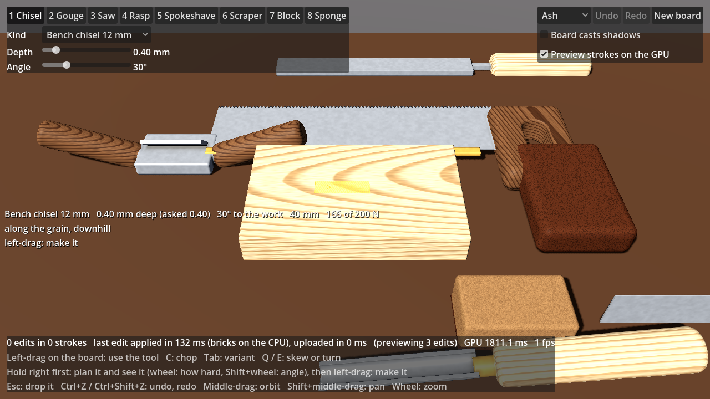 | 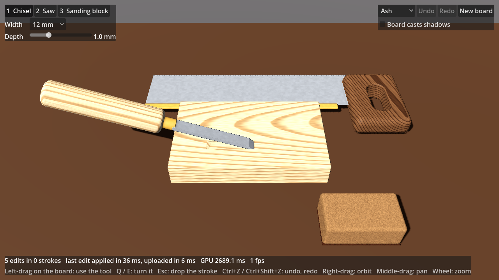 |
| 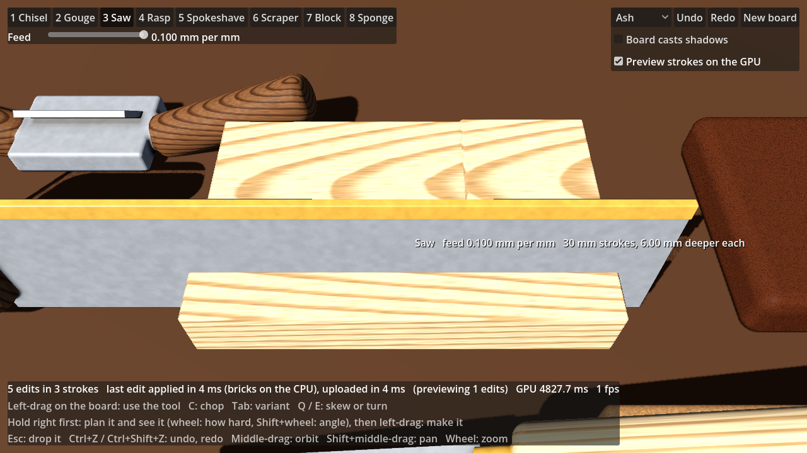 | 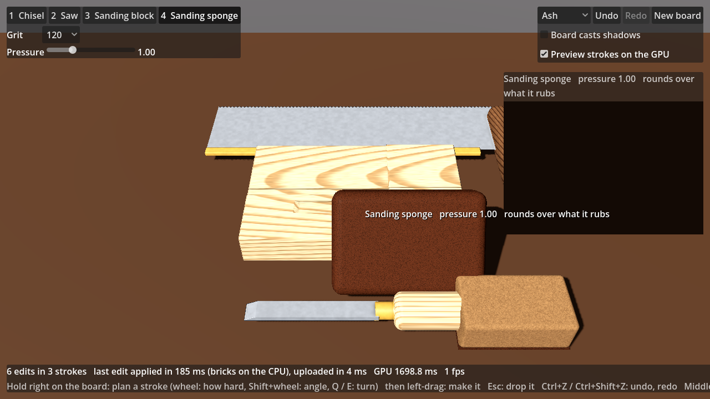 |
| 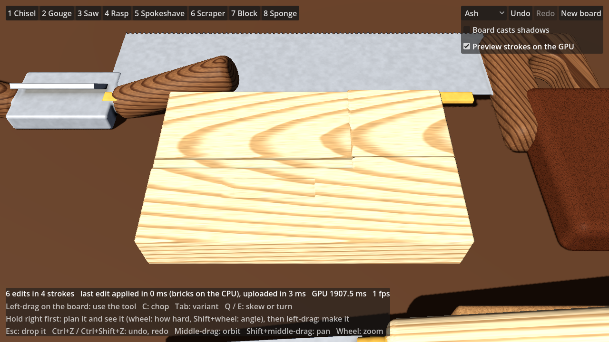 | |

(Rendered here on software OpenGL, at about a frame a second; the status line reads the
GPU time on real hardware.)

**How it works:**
- **Planning** (`SdfBody.plan_stroke`) engages the tool as a stroke would and moves it
  along the path a millimetre at a time. The cut it comes to goes into the shader's
  overlay (below) flagged as planned: the shader hatches the surface wherever a planned
  edit's boundary makes it. Acting carries out the same stroke, so what you see planned is
  what you get, as far as you drag it.
- **Without a plan** the same thing happens at once: a left-drag waits until the pointer
  has moved 2 mm, takes that as the stroke's direction, and `SdfBody.begin_stroke` plans
  a chisel's, gouge's or spokeshave's cut there and then (open-ended, as far as the drag
  goes) without drawing it. So a direct stroke cuts exactly as a planned one would, and
  its report is what the line by the pointer shows.
- **Hiding the tool.** The tool in hand is hidden until it acts. Then it fades in through
  a screen-door dither (`sdf_opacity`), which keeps its depth exact; shadow maps
  (orthographic) draw it whole.
- A tool in use is a *stroke* (`native/src/core/tools/`). It turns the tool's motion into
  edits of the same shapes the tool's model is built from, and gives the cut so far merged
  into as few edits as it takes: the chisel's ramp and flat run, the saw's kerf, the
  block's pass.
- **While the tool moves, the shader draws the stroke.** `SdfBody` hands the merged edits
  to the Live shader as uniforms (the *overlay*, up to 16 edits), and the shader cuts them
  into the field wherever it samples it: the march, the settling steps, the normals and
  the ambient occlusion. Moving a tool costs no CPU work at all, and the cut keeps up with
  the frame rate.
  - Tools only cut, and a cut only ever raises the field, so empty cells stay empty and are
    still skipped whole.
  - A cut applied on top of the field is exactly the body with that edit appended. Where it
    opens up a solid cell, which has no brick, the shader uses the cell's stored material.
  - Normals difference the cut as closely as an exact cell's tape, so its edges stay crisp.
    Bricks keep their taps half a voxel apart, because hardware filtering resolves only
    1/256 of a voxel.
- **When the tool lifts off, the stroke is applied once:** the merged edits, plus the
  chisel's lift-out, go to the body's `EditSession` (`native/src/core/edit/`). That session
  keeps unlimited undo and updates the octree and ADF incrementally; cells that pruning
  shows no changed edit reaches keep their bricks.
  - `SdfBody` applies it on a worker thread, then uploads only the brick layers that
    changed.
  - The stroke leaves the overlay in the same frame as that upload, so nothing pops.
  - Commands that arrive while an update runs are folded together, so a slow update never
    builds a backlog.
  - `game/tests/stroke_preview` renders each tool's preview and its commit and diffs them.
    The mean difference is under 0.1 / 255, and 0.013% of pixels or fewer differ
    noticeably.
- **With the preview off,** each move is applied as it happens. Cuts that only grow keep
  their newest piece open and re-cut just that as it grows. The chisel's 10 mm lengths of
  run and the saw's 1 mm slices of kerf are then left behind, so an update touches only
  what moved. Those pieces overlap generously: inside a union of cuts the field is only a
  bound, and a thin overlap leaves a seam whose value is smaller than the hit epsilon,
  which the raymarcher would draw as a wall. The merged edits have no such seams.

`sdf_bench tools` times both ways on the workshop board (4 shared cores), and the
refinement that follows once the tool is idle (see below):

| Tool at work | Applied as it moves | Previewed, applied on release | Refined when idle |
| --- | --- | --- | --- |
| chisel, 12 mm wide, 1.5 mm deep, pushed 60 mm | 29 updates of 1.9 ms (55 ms in all), 8 edits | 3.0 ms once, 3 edits | 55 ms |
| saw, 12 mm deep in 30 strokes | 30 updates of 3.4 ms (0.10 s), 10 edits | 4.8 ms once, 1 edit | 63 ms |
| sanding block, rubbed over the board | 25 updates of 8.2 ms (0.21 s), 1 edit | 8.8 ms once, 1 edit | 93 ms |
| sanding sponge along an arris, 3 passes of 60 mm | 30 updates of 23 ms (flow 12, octree and ADF 11), 1 layer | (not previewed) | |

Before the changes below, the same commits took 57, 70 and 95 ms, and a sponge update
48 ms. Applied as it moves, the cut lags the tool by an update. Previewed, the cut is there
in the same frame, and the CPU works once per stroke.

### Edits in milliseconds

Applying a cut costs little in itself. What cost the time was refining the creases a cut
makes (its rim, and its floor meeting its walls) down to 1 mm exact cells, eight children
at a time, re-sampling a thousand bricks or more.
- **Coarse first, refined when idle.** An edit stops refining creases at the largest bricks
  (`AdfParams::update_exact_cell`, 7 mm): they become exact cells at once. Exact cells
  evaluate their own tapes, so the surface is the same. Only drawing costs more there
  until `Adf::refine()` takes them down to 1 mm. `SdfBody` refines on its worker once the
  body is idle (no tool engaged, nothing queued: `refine_when_idle`); a new stroke simply
  waits for it. An edit that reaches creases refined earlier redoes them from their big
  cube, so cutting across old work costs no more than cutting a face.
- **Cuts fold into the old bricks.** When an edit only appends cuts (Subtract or
  Intersect), each brick it reaches applies them to the samples it already holds: one
  primitive per sample instead of the cell's whole tape. The usual checks at voxel centres
  catch whatever the cut does between samples (a new crease, a kerf thinner than a voxel)
  and send that cell down the full path. Bricks the cut leaves as they were keep their
  slots and are not uploaded again; the rest are rewritten in place.
- **Half the precision.** Bricks are refined to 10 µm (was 5 µm), and never finer than
  40 µm between samples (was 20 µm). The board takes 7,288 bricks instead of 13,320.
- **Smaller uploads.** Brick layers are 512² (512 bricks), so an edit re-sends a quarter
  as much per layer it touches.
- **Bricks on the GPU.** Where the renderer has a `RenderingDevice` (Forward+, Mobile),
  bricks are sampled by a compute shader (`native/src/godot/gpu_sampler.cpp`). It is built
  from the same primitive and blend includes as the Live shader, with a tape interpreter
  reading storage buffers. The ADF refines a level at a time, so each level's bricks are
  one dispatch: 512 corners and 343 voxel centres each. The CPU keeps only the decisions
  (split, exact cell, brick). Bricks whose tapes hold a smoothing layer (a grid only the
  CPU has) are sampled on the CPU alongside. `SdfBody.gpu_bricks` (on by default) turns it
  off; under Compatibility the CPU samples everything, as before.
  - `game/tests/gpu_bricks` (Forward+) checks that GPU-sampled bricks agree with
    CPU-sampled ones within 0.02 mm near the surface, after a build, after edits and once
    refined; on Mesa's lavapipe they agree within 0.0065 mm. It also prints build and
    refinement times, CPU against GPU. Only a real GPU makes those meaningful: lavapipe is
    the CPU again.

### Sanding as smoothing: a layer, not cuts

A cut is a shape; what a sponge or a sheet of sandpaper in the hand does is closer to
smoothing the surface it is rubbed over. So the sponge does not make edits of shapes at
all. It makes one *smoothing layer* (`native/src/core/body/layer.h`,
`native/src/core/tools/smoothing.h`): the field near the surface, re-sampled on a sparse
grid (0.25 mm) and evolved by curvature flow.
- **Curvature flow.** Where the sponge bears, every point moves inward at a speed set by
  the surface's curvature there, convex parts only: dphi/dt = |grad phi| max(kappa, 0).
  - An arris rounds over, with a radius growing as the square root of the rubbing.
  - Ridges left by other tools soften, while faces and hollows stay put.
  - Each update runs a few explicit steps on the grid near the sponge, in parallel.
- **The layer replaces the field instead of offsetting it.** Inside a sharp arris the field
  itself has a crease (along the bisector: F = -min(x, y)). Adding any smooth offset to F
  would keep that crease, as a ridge along the middle of every sanded edge.
  - So the layer stores the smoothed field phi and a weight w, both reconstructed as
    quadratic B-splines (C1, so normals stay smooth), and gives (1 - w) F + w phi.
  - Where w is 1, none of F's creases remain.
  - B-splines reproduce planes exactly, so flat faces under the sponge do not move by a
    micron.
- **It is one edit, `Op::Layer`, in the edit list like any other:**
  - undo takes it away;
  - later cuts apply over it;
  - a later sponge stroke smooths those.
  - Octree pruning drops it wherever its weight is 0, and bounds it by its samples
    elsewhere.
  - The ADF samples it into bricks like everything else. It never gives it an exact cell,
    because only the CPU holds the grid (the `EXACT` live source draws bodies without their
    layers).
- **Its gradient stays bounded (1.41 plus about 0.15), so rays keep taking safe steps.**
  - Level sets outside the surface move nearly with the surface beneath them (velocity
    extension, capped so the explicit steps stay stable).
  - Inside, each level moves by its own curvature, so levels only spread apart.
  - The bound is measured only down to 0.9 mm below the surface: rays approach from
    outside, and deeper only the field's sign matters.
- **The sponge is applied as it goes.** The shader cannot draw a layer, so there is no
  preview. The worker runs the flow and re-samples only the region whose samples changed
  (`EditSession::revise_stroke` with a changed box). Moving the sponge only records its
  path.

| | |
| --- | --- |
| 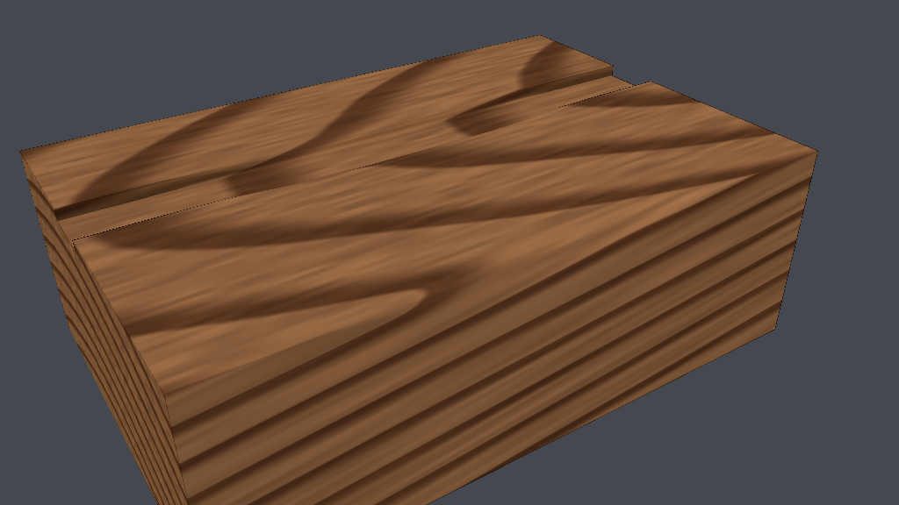 | 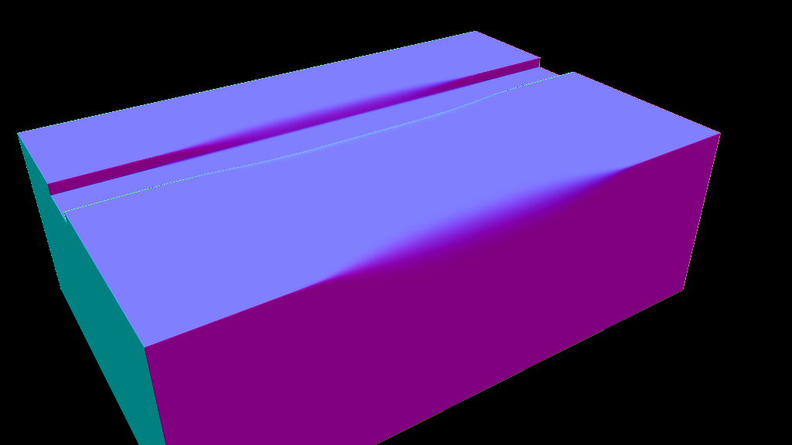 |

The "sanded" demo (`sdf_render sanded`, `load_demo("sanded")`): a sharp walnut block
with a chisel groove, sanded by two sponge strokes, one layer each. It is part of the
GPU/CPU parity set.

### Chisels and gouges cut as the wood lets them

A chisel is not a free cutter. How deep it goes depends on the force behind it, how it
meets the grain and whether the chip has somewhere to go. The workshop's chisels and
gouges follow the real tools (researched from woodworking references: see
[docs/PLAN.md](docs/PLAN.md), "Tools"). Every plan works this out against the board
before the stroke is made (`native/src/core/tools/cutting.h`), and the line by the
pointer says what it comes to.

- **Force.** A chip costs force in proportion to its cross-section, the wood's Janka
  hardness (ash 1320 lbf, oak 1290, walnut 1010) and how the edge meets the fibres:
  - least cutting along them;
  - about 1.8 times that across them;
  - 4.5 times severing them (end grain, or chopping across the grain).

  Each side of the chip still attached to the work adds a strip of shear. A hand pushes
  about 200 N, less on a flexible paring chisel. Where that is not enough, the cut stays
  shallower, and the plan shows exactly how shallow.
- **Clearance.** Held bevel down, an edge bites only when tipped at least 2° past its bevel.
  Held flatter in the middle of a face, it rides on the bevel and *skates*: nothing is cut.
  Tipped past, it dives at the difference until it levels at its depth. Diving steeply, it
  digs in. From an open face (the end of the board, an existing cut) the chip is free in
  front, and the cut goes in at full depth at once.
- **Grain.** The board's fibres rise out of its top face towards +x, as its figure shows.
  Pared that way (downhill) the split running ahead of the edge runs out to the surface,
  and the cut is clean. Pared the other way (uphill) it follows the fibres down, and tears
  out below the cut. Across the grain out of an edge, the unsupported fibres break away.
  Tear-out is seeded, so the plan and the stroke tear the same.
- **Gouges** keep their corners out of the wood, so the chip's sides are free: a #7 goes a
  millimetre deep in the middle of a face, where a flat chisel of its width stays at half
  that. Deeper than its sweep, a gouge's corners bury and its sides tear. A V-tool cutting
  across the grain tears on its uphill wing.
- **Chopping.** Press C, or tip the chisel past 60°. Each click is one mallet blow.
  - The blow drives a thin slit, 2.5 mm across the grain in oak for a 12 mm bench chisel.
    Along the grain it goes further and splits the wood. Each blow goes less far than the
    last.
  - It hollows nothing out. Within reach of an open face on its bevel side, the chip
    between pops off along the grain: chop near an edge, or chop a line and pare towards it.
  - A paring chisel is never struck: pushed by hand, it barely goes in.
- **Skew.** Q / E turn a chisel's edge across its push, and a skewed edge slices for less
  force.

The variants (Tab cycles them; the panel lists them):

| Tool | Bevel | Force | Mallet | For |
| --- | --- | --- | --- | --- |
| Bench chisel 6, 12, 25 mm | 25–27° | 200 N | a bench chisel's blows | paring and light chopping |
| Paring chisel 25 mm | 20° | 160 N (it flexes) | never struck | fine paring |
| Mortise chisel 8 mm | 32° | 200 N | 1.5× a bench chisel's | chopping deep |
| Skew chisel 18 mm | 25°, edge at 30° | 200 N | light | slicing, into corners |
| Gouge #3 and #7, 12 mm | 22° | 180 N | light | smoothing (#3), scooping (#7) |
| Veiner #11 3 mm; V-tool 60° 6 mm | 22° | 180 N | light | lines and grooves |

`native/tests/test_cutting.cpp` holds the calibration (12 mm bench chisel by hand unless
noted):

| Case | Result |
| --- | --- |
| Ash, from the end, along the grain | 0.48 mm deep (1 mm asked) |
| Ash, from the side, across the grain | 0.25 mm |
| Walnut, from the end, along the grain | 0.61 mm |
| Middle of the face, held at 20° (bevel 27°) | skates: nothing |
| The same, tipped to 33° | dives at 6°, levels at 0.3 mm as asked |
| #7 gouge vs the chisel, mid-face, 1 mm asked | 1.00 mm vs 0.48 mm |
| Skewed 30°, 0.2 mm | 58 N instead of 83 |
| Oak, chop across the grain | 2.52 mm; the next blow 1.72 more |
| Oak, chop along the grain | 6.2 mm, and it splits |
| Mortise chisel 8 mm vs a bench chisel of 8 mm | 1.5× per blow |
| Paring chisel, chopped | 0.02 mm: never struck |

### Shaping and finishing: rasps, a card scraper, a spokeshave

`native/src/core/tools/shaping.h`:
- **Rasps** (a coarse wood rasp, a cabinet rasp flat or round, a fine patternmaker's) take
  a tiny bite with each tooth, so they never tear the grain, whichever way they go.
  - They remove steadily, faster the coarser they are and the harder they are pressed,
    slower in harder wood. A cabinet rasp takes about 0.03 mm of ash per 40 mm stroke there
    and back, 0.24 mm in ten 60 mm strokes.
  - The flat face lowers what it is rubbed over. Tilted about its line (Shift+wheel) along
    an arris, it takes a chamfer off it. The round face hollows.
- **The card scraper**, flexed, takes a whisper: about 0.006 mm a 100 mm stroke, feathered
  at its sides, and it cannot tear out. It is for cleaning up tear-out and tool marks.
- **The spokeshave** is a plane with a 40 mm sole.
  - Its sole rests on the work, the lowest line lying on the surface under it: the surface
    itself where it is convex, bridging hollows shorter than the sole.
  - Its blade takes a shaving that far below: an even 0.1 mm on a flat face from its first
    millimetre (where a chisel has to dive in), following a curve, leaving a groove alone.
  - Two hands push it (250 N). Against the grain it tears out as a chisel does, at half
    the rate: its mouth keeps the split short.
- `native/tests/test_shaping.cpp` checks each of these, and `game/tests/tool_planning`
  makes a spokeshave pass and ten rasp strokes in the workshop.

### Pieces: sawn through, the board comes apart

Saw right through the board and the strip you cut off comes away. It is a body of its own,
resting on the bench, and still editable. Undo straight after puts the pieces back together.
Fracture and failing joints will split bodies the same way later
([docs/PLAN.md](docs/PLAN.md), "Pieces"); only what cuts them will differ.
- **Detecting it.** A saw stroke that has gone through reports its kerf's middle plane
  (`Stroke::separation`). After its commit, the worker checks the plane with
  `plane_clear` (`native/src/core/pieces/`). This is an adaptive quadtree over the plane
  within the body's bounds. A square is proven free of material when the field at its
  centre exceeds the Lipschitz bound times its half-diagonal; otherwise it splits, down to
  0.05 mm. If no material crosses the plane, the two sides cannot be joined: any path
  between them crosses it. On the board the check takes about 13 ms.
- **Measuring it.** The same worker then measures both sides from the ADF
  (`measure_sides`): volume, centre of volume and hull points, in about 30 ms more. It
  turns the plane so that the smaller side is in front, and `SdfBody` emits
  `separated(point, normal)`.
- **Splitting without waiting.** `SdfBody.split(point, normal)` returns a new body for the
  part in front of the plane and keeps the part behind it. It takes the worker's
  measurements and reads nothing else from the body, so it costs about 3 ms of the frame.
  It used to measure there and then wait for the pieces' rebuilds, which stalled the frame
  for about half a second.
  - Each piece appends an `Op::Intersect` with its half-space, as an undo step. The plane
    sits 5 µm into the kerf from the piece's own face, not in the kerf's middle. A plane
    in the middle would leave a kink in the field just outside each face (where the
    other face used to be), and the ADF would refine it along the whole face.
  - Until the half-space lands, the shader's overlay draws it: the same mechanism that
    previews strokes (W2a) cuts the other side away.
  - Both pieces draw the same textures until one of them uploads. That piece makes new
    textures, the one full upload a split costs; the other then updates its own in place.
    Brick textures are made a quarter larger than needed, so a brick pool that grows while
    refining seldom sends them whole again.
  - Nothing waits on a rebuild.
- **Physics.**
  - Each piece's mass (from its volume and the wood's density) and its centre of mass
    come from the worker's measurements.
  - Its rigid body sits at its centre of mass, because Godot's automatic one follows shape
    origins.
  - Its collider is a box when the piece fills at least 90% of its bounds, as a sawn
    strip does, and a convex hull otherwise. The hull's points are brick zero crossings,
    reduced to the extremes along 256 directions, then to the outermost of any within
    1 mm. Left as tight clusters round corners and edges, they made sliver faces the
    offcut rocked and sank on.
  - The offcut gets a 0.25 m/s nudge off the kerf; the kept board gets a static hull.
- **Millimetre tolerances.** Godot's physics engines are tuned for metre-sized objects:
  Jolt, the default, lets contacts overlap by 2 cm. `project.godot` sets the overlap to
  0.2 mm (`[physics]`), so a 25 mm offcut rests on the bench instead of sinking into it.
- **Measured** (`game/tests/offcut_physics`, 1 s after the saw goes through; Jolt's figures
  match its 0.2 mm slop). `tools/compare_physics.sh` repeats it under Box3D, Erin Catto's
  new engine, through the experimental
  [godot-box3d](https://github.com/bearlikelion/godot-box3d) extension (built from source,
  never committed):

  | | Jolt (default, tuned), box | Jolt, hull | Box3D, box | Box3D, hull |
  | --- | --- | --- | --- | --- |
  | sinks into the bench at rest | 0.20 mm | 0.20 mm | 0.09 mm | 0.16 mm (4.2 at worst) |
  | tilts | 0° | 0.5° | 0° | 0.7° |
  | slides off the kerf | 5.7 mm | 5.4 mm | 0.9 mm | 2.2 mm |
  | per physics step | 0.25 ms | 0.30 ms | 0.24 ms | 0.27 ms |

  Both handle it. Box3D's friction combines differently, hence the shorter slide. It is
  still alpha, as is its Godot extension, so the default stays Jolt.

### Islands: cuts meeting, no plane

Cuts that meet can free a piece no single plane separates: a rebate sawn off the end (one
cut down from the top, one in from the end), a corner cut off by two slots, a chip
chiselled free. That piece comes away too, and it rests where it lies.
- **Finding it** (`native/src/core/pieces/parts.h`). Once the board is idle after a commit,
  its worker looks round the cut for parts of the material that no longer hold together
  (`find_parts`). The ADF's inside samples are joined, in parallel within each brick, then
  across the faces between leaves (the octree face procedure):
  - plain bricks are trusted as drawn (a gap they would show has samples in it);
  - in exact leaves, where the brick strays from the field, the exact tape along the
    segment between two samples decides, so a slot a tenth of a millimetre wide still
    parts the board.

  If the material round the cut is one piece, nothing came away (the body was one piece
  before, and any path round the cut can go round inside the region). If a part lies
  wholly inside the region, it is the island: a chip is found this way in about 10 ms.
  Otherwise the region grows once to hold the smaller parts, then the whole board is
  looked at (about 35 ms for its 7,300 bricks).
- **Cutting it out, proved apart** (`cut_out`, `body/region.h`). The island is cut out by
  a *region*: an octree of cubes marked as the island's (its material and the air near
  it), the rest's, or free (air at least 0.05 mm clear of every surface, by the exact
  field). Cubes split where both sides' samples share one, and wherever an island cube
  meets a rest cube across a face that is not clear, down to 0.05 mm. When no island cube
  touches a rest cube, every path from one to the other crosses clear air: the island
  truly came away. If they still touch at the finest (a web too thin for the samples to
  see), nothing splits.
- **Keeping one side** (`Op::Keep`). Each side takes the region into its edit list as an
  undo step. Where it drops, the field becomes `max(d, 0.1 - d)`: at least 0.05 mm, so no
  surface is left and the octree takes those cells for empty. Kept and dropped cubes meet
  only across free ones, where that is just `d`, so the field stays continuous. The shader
  cannot evaluate a region (a sampled octree only the CPU holds), so tapes holding one
  never become exact leaves, and the island's body stays hidden until its region lands;
  the board shows the island until then.
- **Physics.** Where an island came out the board is hollowed, and one hull would fill the
  hollow, so the board's collider becomes convex pieces: its bounds cut into boxes by the
  faces of each island's box (0.3 mm outside it), each box's piece the hull of the
  surface points and material in it. No piece reaches into an island's box. Two things
  the engine needed at millimetre scale:
  - shapes with a 0.1 mm margin (Godot's default of 4 cm rounds them away);
  - the island set down just into what is under it before it is let go, and let go
    asleep: a body's first step finds no contact yet (falling from a kerf's width above,
    it drops 2.7 mm into the surface), and on the few points of a sampled surface it
    would rock. Nothing under it, it falls.

  (A triangle mesh of the board's surface was tried first: the engine drops triangles of
  a millimetre or two as degenerate, and coarser ones misplace the surfaces round a
  rebate. Proper meshes come with the Bake step.)
- **Measured** (`game/tests/island_split`): the rebate, a 1,800 mm² interface, is found and
  cut out in about 600 ms on the worker (about 160,000 region cubes, most of the time);
  split in about 3.5 ms of the frame; it rests in the rebate, 1.1 mm down (its kerf) and
  none across. The island's own ADF costs about 1.7 times the bricks its surface had in the
  board's, where the region keeps its creases from becoming exact leaves.

### Shavings and chips: what the tools take off

A chisel's, gouge's or spokeshave's shaving curls up off the edge as the stroke goes, and
drops when it breaks or the stroke ends. Tear-out, breakout and a chop's pop-off throw
chips. They land and lie where they fall; undo takes a stroke's back, a new board or
*Sweep* clears them. Debris never goes back into a body: it only shows what came off.
- **The report** (`native/src/core/tools/debris.h`). As a previewed stroke moves, it says
  what it took off since it last said, read from the body as it was before the stroke
  (the body is only changed when the stroke lands). A planned stroke samples its shaving
  every half millimetre: from the cut's floor up to the surface the edge came in under
  (thinner over a rounded edge, nothing over a groove), as wide as the edge's chip (a
  gouge's curved chip: its area over its thickness). Each chip is reported once, when the
  edge reaches it: the material its cut takes beyond the floor's, sampled over its box.
  `SdfBody.take_debris()` hands it over in world space, coloured by the wood where it
  came from (`albedo_at`: the grain and rings run on into the shaving).
- **Breaking.** Cut along the fibres a shaving holds together; severing them it crumbles:
  it breaks every (1.5 + 3 (1 − split)) / grain mm, about 10 mm across the grain in ash,
  2.4 mm into end grain. It breaks too wherever the edge passes over air.
- **The curl** (`game/workshop/debris.gd`). The shaving rides up the blade's back and
  curls over, tighter the thinner it is (a radius of 1.5 mm + 12 times its thickness,
  winding in a thickness a turn so the turns never meet). It comes off 0.7 as long and
  1 / 0.7 as thick as the cut (the same wood, compressed along the cut). Drawn as a ribbon
  with the wood's colours, rebuilt as it grows (at most about 0.5 ms a frame).
- **Physics.** Released, a shaving is a rigid body whose collider is the box round the
  curl in its own frame: a hull round the curl rocked from facet to facet and never came
  to rest. It weighs at least a few grams to the solver (lighter bodies this small are
  shaken about), and is damped (light and springy, it soon lies still). The board has a
  collider while debris lies about. The newest 24 pieces move; older ones stay where
  they lie; past 300, the oldest go.
| | |
| --- | --- |
| 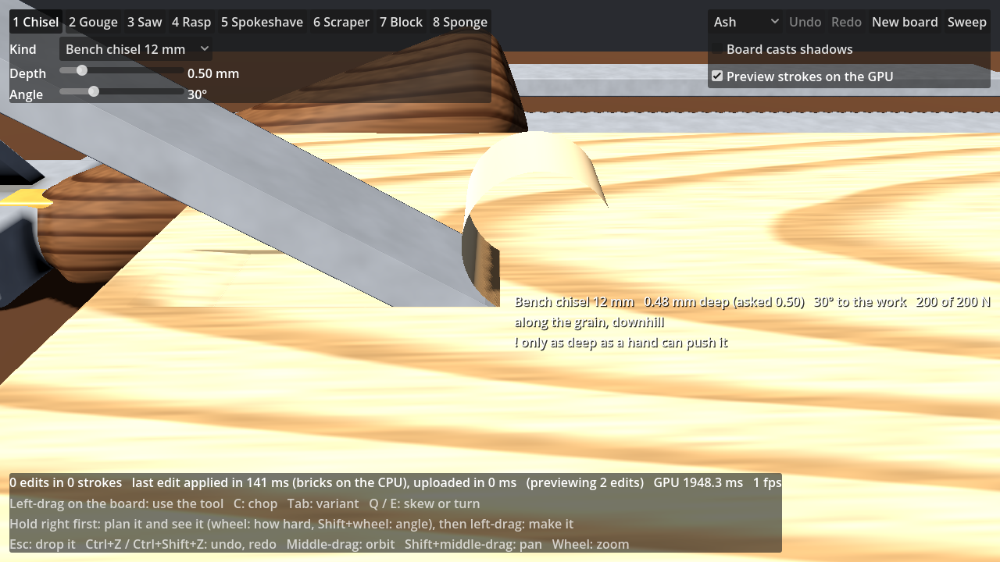 | 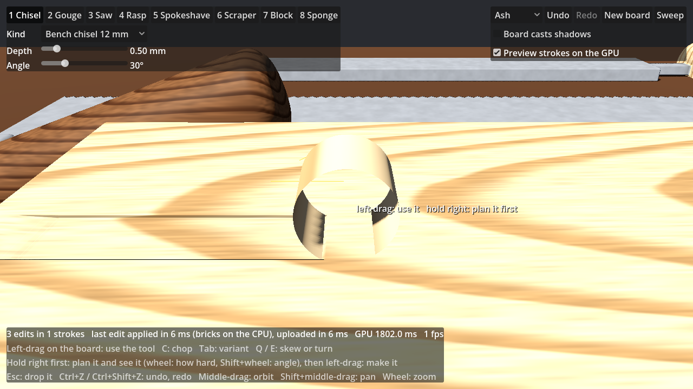 |

- **Measured** (`native/tests/test_debris.cpp`, `game/tests/debris`): a paring cut's
  shaving is within 1% of the volume the board lost (sampled by columns, before and
  after); the shaving and the tear-out chips of an uphill cut in oak together, within 1%;
  in the workshop, a 50 mm paring cut 0.5 mm deep gives a 255 mm³ shaving (the board lost
  248), at rest on the board within a second.

## Layout

| Path | What it is |
| --- | --- |
| `native/src/core/shared/*.glsl` | The SDF formulas — primitives, tool cross-sections, swept strokes, blend modes, materials. Written in a subset that compiles **both as C++ and as Godot shader code**, so the CPU evaluator and the GPU raymarcher run the same maths. Edit these only. |
| `native/src/core/glsl_compat.h` | Just enough GLSL (`vec3`, `mix`, `clamp`, …) in C++ to compile the shared files. |
| `native/src/core/body/` | `Body`, `Edit`, `Primitive`: the per-part source of truth, bounds and Lipschitz bounds; smoothing layers (`layer.h`); the material table. |
| `native/src/core/compile/` | The octree: per-cell pruned edit lists ("tapes") that keep per-query cost independent of edit count. |
| `native/src/core/adf/` | The adaptive distance field: the Live display cache (sampled bricks, exact cells at creases). |
| `native/src/core/eval/` | The CPU reference renderer (ground truth for every later GPU path) and exact ray queries. |
| `native/src/core/tools/` | The hand tools: each one's model and the cuts it makes, strokes that turn a tool's motion into edits, and the curvature flow that builds a sanding sponge's smoothing layer (`smoothing.h`). |
| `native/src/core/pieces/` | Bodies that come apart: whether a cut left two parts (`plane_clear`), and each piece's bounds, volume, centre of mass and hull points. |
| `native/src/core/edit/` | `EditSession`: a body's edits with the stroke in progress and undo / redo, its octree and ADF kept up to date incrementally. |
| `native/src/demo/`, `native/tools/` | Demo scenes; `sdf_gallery` (renders the galleries), `sdf_render` (renders any demo, diffs against another image) and `sdf_bench` (octree scaling). |
| `native/src/godot/` | The GDExtension: `SdfBody`, a node that raymarches a body live, and the GPU brick sampler. |
| `native/tests/` | Property tests for the core and golden-image tests. No Godot needed. |
| `game/` | The Godot 4.7 project. `game/workshop/` is the workshop (the main scene); `game/shaders/sdf/` holds byte-identical copies of the shared files plus `sdf_live.gdshader`; `game/bench/` the decision-gate benchmark. |
| `extern/godot-cpp/` | godot-cpp 10.0.0 (submodule), built against the Godot 4.7 API. |
| `tools/` | `sync_shaders.sh`, `run.sh` (headless / Xvfb scene runner, OpenGL or Vulkan), `test_godot.sh`, `parity.sh`, `compare_physics.sh` (Jolt vs Box3D on a sawn offcut). |
| `docs/PLAN.md` | The plan: principles, what is done, and the roadmap from here. The first plan is archived in `docs/archive/plan-v1.md`. |

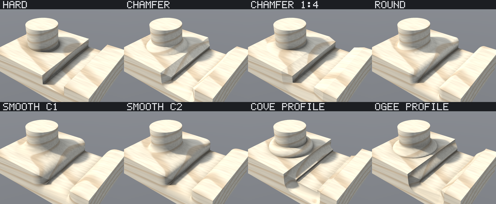

## Blend modes

The primitive decides the surface; the blend mode decides the edge where two surfaces meet.
Every mode has compact support — beyond its radius it is exactly the hard result — so an
edit only reshapes the field near its own primitive.

| Mode | Edge | Lipschitz |
| --- | --- | --- |
| `Hard` | crisp arris | 1 |
| `Chamfer` | flat bevel, optionally asymmetric (`r` onto one surface, `r2` onto the other) | √2 |
| `Round` | circular fillet, unchanged outside it | √2 |
| `Smooth`, `SmoothC2` | organic polynomial blend (C1 / C2); mixes materials | 1 |
| `Profile` | router-style edge profiles: arc concave, arc convex, ogee | √2 |

Operators: union, subtract, intersect, plus engrave / groove / tongue along a guide
surface, and paint (material only). Tool strokes sweep a flat, V or gouge cross-section
along a segment or a quadratic Bezier.

## Materials

Materials are evaluated in each part's own space, relative to where it sat in the log or
block, so a cut reveals the figure that was always inside it. Smooth blends mix materials;
hard ones keep a crisp boundary on one continuous surface.

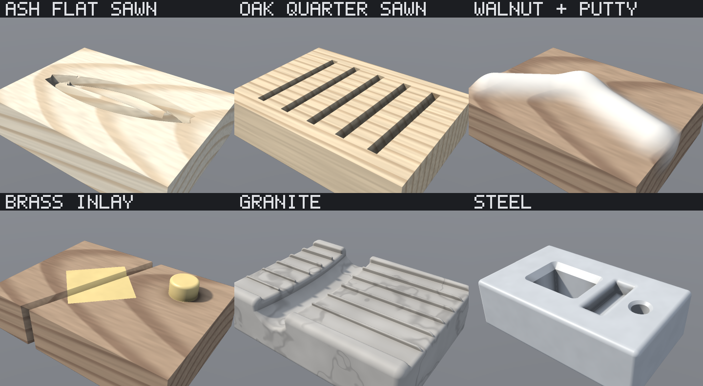

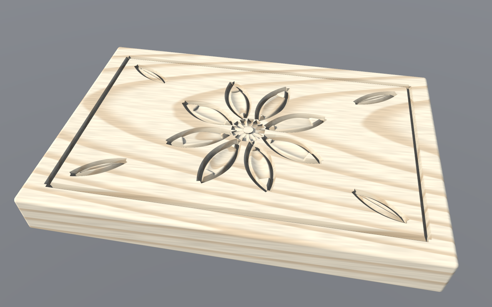

These are rendered by the CPU reference renderer (`native/src/core/eval`): sphere tracing
with Lipschitz-scaled steps and a pixel-footprint hit epsilon, SDF soft shadows and SDF
ambient occlusion. It is slow on purpose — it is the ground truth the GPU path is
diffed against. `Body::sample` already skips, per point, every edit whose bounding box
is at least `|d| + influence` away, which provably never changes the result's sign.

## Scaling to many edits: the octree

A carving session is thousands of strokes; a stone job, tens of thousands of chips.
Evaluating every edit at every point would make each query cost O(edits). Each body is
therefore compiled into an adaptive octree whose cells hold a pruned **tape**: only the
edits that can shape the surface inside that cell, in order.

**The contract:** inside every cell, a tape's field has exactly the body's sign, and its
exact values within `value_margin` (1 mm) of the surface — enough for hits, normals and
shadows. Further out it is a valid distance bound for that cell, so tracing clamps every
step at the cell's exit and skips cells proven empty.

Edits are dropped from a cell by rules that each preserve that contract:

- **Reach.** Its bounds, grown by its own blend reach, by the widest reach of any *later*
  edit that reads values in the cell, and by the value margin, miss the cell. (Hard min /
  max only depend on their operands' signs, but a later blend reads actual values, which a
  dropped neighbour could otherwise have fed.)
- **Interval arithmetic.** The field's range over the cell is tracked through every op's
  own rules. An edit that provably changes nothing is dropped; one whose primitive alone
  defines the whole cell *resets* the tape — unless an earlier union or paint put a
  different material there, which a cut must still expose.
- **Supersession.** A hard cut provably contained, throughout the cell, by a later hard
  cut is dead: finishing cuts supersede roughing cuts. Monotone blends in between widen the
  margin the later cut must win by; profiles, guide ops and material changes stop the search.

Cells split while their tape exceeds a budget, but never below half the smallest feature
in the tape: chipped stone does not need the sub-millimetre cells a fine V-tool line does.
Curved strokes tighter than their tool can follow are refused by `Body::add` — they are
not cuts a real tool makes, and their distance bound degrades too far.

`sdf_bench`, a granite block roughed out by percussive chips (4 cores):

| Chips | Build | Add one chip | Surface cells | Mean tape | Memory | vs full edit list |
| --- | --- | --- | --- | --- | --- | --- |
| 1,000 | 0.003 s | 7 µs | 820 | 4.3 | < 1 MB | 75× faster |
| 10,000 | 0.16 s | 30 µs | 55 k | 7.6 | 3.5 MB | 380× faster |
| 100,000 | 10.7 s | 1.0 ms | 1.0 M | 14.7 | 183 MB | 965× faster |

The 100k case is heavy mostly because a 0.4 m² worked face at millimetre detail simply has
that many cells; consolidating old chips into a sampled base field (planned alongside
forging) is what will bound it for very long jobs.

## In Godot: the Live path

`SdfBody` (a `MeshInstance3D`) compiles its body into the octree and an **adaptive distance
field** (ADF, below), and flattens both into data textures. A proxy box around the body
runs the Live shader (`sdf_live.gdshaderinc`), which sphere-traces each pixel in the body's
own millimetres. It writes the true hit's depth, normal and position (`DEPTH`, `NORMAL`,
`LIGHT_VERTEX`), so Godot lights and composites it like any mesh. Adding a stroke updates
the touched cells and bricks and uploads only what changed; nothing is meshed.

**The ADF.** Interpreting edit tapes per pixel costs the tape's length in texel fetches on
every frame, for edits that never change. So each edit is evaluated once per affected
voxel instead, when it is made:
- The octree continues into bricks of 8³ half-float distance samples along the surface.
- Each cell is refined until trilinear reconstruction is within 10 µm of the exact field
  near the surface. Planes are exact under trilinear filtering, so flat and gently curved
  faces get coarse bricks (up to 1 mm between samples).
- Creases would need ever finer bricks, so a crease cell ≤ 1 mm becomes an *exact* cell
  (≤ 7 mm right after an edit, until it is refined: see "Edits in milliseconds"). Rays
  march on its brick while they are further from the surface than the brick's error band,
  then evaluate its own tape: the octree tape pruned again to that small cell, which leaves
  only the 2–3 edits forming the crease. Hits, normals and materials there are exact. The
  band is measured when the cell is built (twice the worst brick-vs-tape difference near
  the surface), some 30× narrower than the worst case L · voxel · √3, so rays reach the
  tape later and need fewer tape steps.
- Lookups start from a 64³ grid over the root cube that names each block's node, a few
  levels above its leaves, instead of descending a dozen levels from the root.
- Normals come from the hit's own leaf: four taps on its brick, or one pass over its tape
  for all four taps in an exact cell. The tape interpreter is inlined wherever the shader
  calls it, so it is called from three places only.
- Bricks live in a `Texture2DArray` (512² layers of 512 bricks) and are read with hardware
  filtering. An edit
  re-samples the cells it reaches, reuses the rest (slots and all) and uploads only the
  layers that changed. "Reaches" is decided by pruning, not by the edit's bounding box: a
  long curved stroke's box holds several times more cells than its groove touches.
- The exact field stays the truth: bricks are a display cache, like a baked mesh.
  `live_source = EXACT` raymarches the tapes alone, for comparison.

`sdf_bench adf` (4 shared cores; per stroke before W4, at 5 µm and refined in full at
once, in parentheses):

| Body | Edits | Build | Memory | Exact cells | Per stroke |
| --- | --- | --- | --- | --- | --- |
| carved panel | 52 | 0.55 s | 16 MB | 4,616 | 6.9 ms (28) |
| fluted ball | 6 | 0.05 s | 3.0 MB | 0 | 2.2 ms (6) |
| random session | 227 | 2.5 s | 29 MB | 14,025 | 23 ms (51) |
| random session | 1,495 | 15 s | 50 MB | 22,516 | 60 ms (182) |

Nearly all of that is evaluating primitives at brick samples (callgrind: 80%), a quarter
of it in the Bézier strokes' cubic solve.

The shader is bound by texture fetches, as Claybook's SDF tracer was. `sdf_bench count`
replays it on the CPU for the benchmark's views and counts texel fetches per pixel:

| View | Exact tapes (E3b) | ADF (E3d) | ADF, measured bands and grid (E3e) |
| --- | --- | --- | --- |
| panel filling the screen | ~1070 | 129 | 64 |
| close-up of the rosette | ~1670 | 262 | 128 |
| 2000 random strokes | ~15,000 | 765 | 335 |

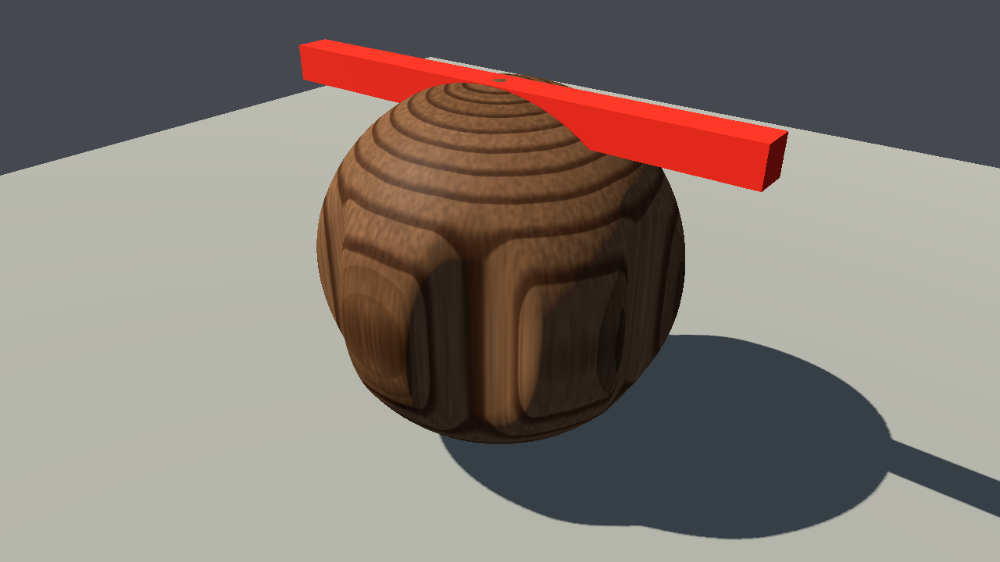

**Parity.** `tools/parity.sh` renders every demo through Godot and diffs it pixel by pixel,
from the same camera, against two CPU renders:
- the formula field (every edit, in order, no octree): the ground truth;
- the CPU tracing the same source (the ADF), the same algorithm, so any mismatch is a
  shader bug.

Normals check geometry and unlit albedo checks materials. The 27 cases are the 8 blend
modes, 6 material scenes, the carved panel, the fluted ball, a 300-stroke session and the
sanded block (smoothing layers), at 1280x720.
- **Against the ground truth:** the mean channel difference is at most 0.34 / 255, and at
  most 0.16% of pixels differ by more than 24 / 255. Those are single pixels on silhouettes
  and creases, where a pixel centre falls on one side of the edge or the other.
- **Against the CPU ADF:** at most 0.007% of pixels differ.

The exact Live path (`PARITY_ARGS=--live-source=exact`) matched the ground truth within
0.23 / 255 and 0.05%. It skips the sanded block: it draws bodies without their layers. Results are identical with the node scaled to a metre world
(scale 0.001).

What was checked in Godot (Compatibility renderer, the only one without a GPU):

| Check | Result |
| --- | --- |
| Depth composition with meshes | exact: meshes pushed into a body are cut at its surface |
| Casting shadows | works: the shadow pass runs the raymarch and takes its depth (opt-in, see below) |
| Receiving shadows | Forward+ / Mobile look shadows up per fragment at `LIGHT_VERTEX` (from Godot's source, to confirm on hardware); Compatibility computes shadow coordinates per vertex, on the proxy box, so there Live bodies receive no shadow-map shadows |
| Orthographic cameras (directional shadow passes are orthographic) | works |
| Metre-scaled world | works, parity unchanged |

**The decision gate** (plan §4) runs `game/bench/live_bench.tscn` on real hardware. The
first run (RTX 3060 Ti, Forward+, 1280x720) failed it clearly:

| Scenario | GPU median | Target (at 1080p) |
| --- | --- | --- |
| panel filling the screen | 19.1 ms | 6 ms |
| close-up of the rosette | 40.7 ms | 6 ms |
| 2000 random strokes | 283.9 ms | 6 ms |
| three bodies | 21.6 ms | 8 ms |

Where the time went (counted by replaying the shader on the CPU, and timed with Mesa):
- raymarching again in every shadow pass: about two thirds of the frame;
- Forward+ running the shader twice (depth prepass and colour pass);
- evaluations after the hit (refine, normal, AO): about 75% of the rest;
- about 8 texel fetches per edit in each evaluation.

The measured times track the fetch count (close-up ≈ 1.6× the panel's, 2000 strokes ≈ 14×).

What changed:
- Live bodies no longer cast shadows by raymarching unless `live_shadows` is on; the
  baked mesh (E4) will cast them. When they do, the caster marches bricks only: a shadow
  map cannot resolve an exact cell's error band.
- They draw in one pass (`sdf_live_single.gdshader`: the transparent pipeline, which skips
  the depth prepass but still writes depth). This also fixed speckle on Forward+: after its
  prepass, Forward+ redraws opaque materials with an exact-equality depth test, and a
  raymarched depth recomputed by a separately compiled shader variant misses it on some
  pixels. With `live_shadows` on, an internal shadows-only child runs the opaque variant
  in shadow passes, where no such test applies.
- The ray and the post-hit taps stay in their octree cell.
- Rays end at the opaque scene's depth (read in the single pass), so the parts of a body
  hidden behind meshes cost nothing.
- Edit, node and tape records are packed tighter.

Parity is unchanged. On Mesa that is 5.5× faster, and rendering 3D at half resolution
another 3.4×. The ADF (above) then removed the tape-length term from the per-pixel cost.

Run it after building (below):

```sh
godot --path game res://bench/live_bench.tscn                                   # Forward+
godot --path game --rendering-method gl_compatibility res://bench/live_bench.tscn
```

Use a 1920x1080 window if the screen allows. The switches after `--` show where time goes:
`--shadows=off`, `--live-shadows=on`, `--live-source=exact`, `--exact=off` (the ADF's crease
cells shade from their bricks, to measure what their tapes cost), `--ao=off`, and
`--scale3d=0.5` for half-resolution 3D. `--view=steps` shows step-count heat maps, and `--shots=<dir>`
saves each scenario.

## Building and testing

The core has no dependencies; the tests and the image tools need zlib (for PNGs), and the
Godot extension needs the godot-cpp submodule. The first build compiles godot-cpp's
bindings, which takes a few minutes; `-DSDF_BUILD_GODOT=OFF` skips the extension.

```sh
git submodule update --init
cmake -S native -B native/build -G Ninja
cmake --build native/build        # also writes game/bin/sdf_godot.<os>.<ext>
native/build/sdf_tests            # property tests (exactness, compact support, Lipschitz
                                  # bounds, no phantom surfaces, material weights, culling)
                                  # and golden images of the demo scenes
native/build/sdf_gallery out 2 2  # re-render the gallery images at 2x, 2x2 supersampled

GODOT=/path/to/godot tools/test_godot.sh        # headless tier: the Godot-side logic
GODOT=/path/to/godot tools/test_godot.sh --gpu  # GPU tier: renders, images, parity
GODOT=/path/to/godot tools/run.sh --vulkan res://tests/gpu_bricks.tscn   # GPU vs CPU bricks,
                                           # with build and refinement times
native/build/sdf_render carved_panel out/panel.png --view normals   # any demo, any view
```

The Godot tests come in two tiers:
- **Headless** (`tools/test_godot.sh`, under a minute on a CPU):
  - the extension loads;
  - the workshop's tools cut and undo;
  - stroke previews commit as previewed;
  - planned and direct strokes;
  - offcuts and islands come away and settle;
  - shavings and chips come away as much wood as the board lost, and settle.

  One frame is rendered in software to check that the Live shader and the shared includes
  compile in Godot's pipeline. Nothing judges pixels. Without a GPU, this is the tier to run.
- **GPU** (`tools/test_godot.sh --gpu`): everything that looks at images:
  - live renders;
  - the workshop and planning drives with screenshots in `out/`;
  - stroke previews compared with their commits image by image;
  - GPU/CPU parity (`tools/parity.sh`);
  - with a Vulkan driver, GPU brick sampling (Forward+).

  It needs xvfb-run. It runs on Mesa's software drivers too, but at about 2 s a frame on
  llvmpipe that takes around half an hour.

After editing anything in `native/src/core/shared/`, run `tools/sync_shaders.sh`; the
test suite fails if the Godot copies drift. After an intended visual change, rewrite the
golden images with `SDF_UPDATE_GOLDEN=1 native/build/sdf_tests golden` — and look at them
before committing. The goldens are bit-identical across GCC and Clang, optimised or not,
on x86-64; the tolerances are there for MSVC and ARM.
