# Object Builder — SDF engine

The engine for a crafting game where players make working objects — a pickaxe is a
steel head, an ash handle and a wedge — from parts shaped by real processes and then
joined. Every part is a **signed distance field**: an analytic base shape plus an ordered
list of edits (tool strokes, fillets, inlays, paint), each combined with a chosen blend
mode. The full design is in the approved plan; this README covers what exists today.
For the whole picture on one page (what exists, what comes next and how to work on it),
read [PROJECT_CONTEXT.md](PROJECT_CONTEXT.md).

## The workshop

Open `game/` in Godot 4.7 and press F5 (or run `godot --path game`). You stand in a small
workshop, seen through your own eyes: a workbench with a vise in the middle of its top, an
ash board clamped in it, a side table to its right, and a lumber rack against the left wall
with stacks of ash, oak and walnut boards. The room is built in code (`game/workshop/room.gd`);
the world is in metres, the bench top at y = 0 with the vise at its middle.

**Walking** (`game/workshop/player.gd`, a first-person `CharacterBody3D`):
- **WASD** or the arrows walk (1.5 m/s), **Shift** hurries (3 m/s), the mouse looks about.
  Esc frees the mouse; a click takes it back.
- **The hotbar** along the bottom holds the tools: a chisel and a carving gouge (each in
  several kinds), a back saw, a rasp, a spokeshave, a card scraper, a sanding block, a
  sanding sponge, and the layout tools (a marking gauge, a knife and square). Keys **1 to 9**
  (or a click, or the wheel) put one in hand, held in view;
  **0** empties the hands. Every tool is an SDF body, built by the engine in steel, brass,
  ash, walnut, cork and abrasive.
- **E** does what the line under the crosshair says, within 2 m:
  - on a piece of work lying about (a board, an offcut): **pick it up**;
  - on a stack on the rack: **take a new board** of that wood into your hands;
  - on the bench, or the piece in the vise: **step up to the bench** (below);
  - carrying something: **let go** of it.
- **Carrying.** A piece in your hands is held in front of your eyes, turned as you turn. It
  is a rigid body pulled to that spot each physics step, so it still meets the bench and
  the walls, never passing through them. **R** turns it a quarter turn, the **wheel**
  brings it nearer or farther (0.35 to 1.2 m). The tool in hand is put away while your
  hands are full. Let go, it falls where it is.
- **The vise.** Let go with the crosshair on the vise (the bench top between its jaws) and
  the piece goes in, squared: the way through it nearest the vertical turned exactly up
  (a board flat, on edge or on end, as you held it), the longer of the other two along the
  bench, set on the bench top in the middle of the vise. The jaws close on it. The vise
  holds one piece: with one in it, letting go there just drops what you carry. **F** on
  the piece in the vise takes it out into your hands, its cuts and its undo history with it.

**Working** (the view you step into at the bench). E at the bench, with a piece in the vise,
brings the view down over the vise and frees the mouse. The tools work on the piece clamped
there, as below. **Esc** drops a plan or a stroke in progress, and with nothing to drop
steps back to your own eyes. With the vise empty there is nothing to step up to; the line
under the crosshair says to put a piece in it.

**Laying out** (9, `game/workshop/layout.gd`), as a joiner marks the work before cutting it:
- **The marking gauge.** The wheel sets it (0.5 mm a notch, Ctrl finely). Its fence rides
  the face beside the edge nearest the pointer, and the line shows where it would go:
  parallel to that edge, that far in, on the face under the pointer.
- **The knife and square** (Tab). The square's stock rides the nearest edge, and the line
  runs across the face, square to it, through the pointer.
- **Scribing.** A click scribes the line the whole way across the face; a drag, only as
  far as it goes. The line is a real cut, a knife's V 0.3 mm deep (core
  `tools/layout.h`), and one undo step.
- **Marks.** The line is also a mark on the piece, in its body space so it moves with the
  piece. Marks are drawn while a tool is in hand, and undo and redo take them with their
  cuts.
- **The lines hold the tools.** A stroke locked or pressed on the piece is held to the
  lines marked on it (drawn blue while it is; *at the line* where they stop it). What a
  line means depends on how the tool is held:
  - **Flat on a face.** A gauge line on the face beside, gauged from this face's edge, is
    the floor: the face goes down to it and no deeper (a rebate's depth; with a width line
    on this face too, only between that line and its edge). A gauge line on this face is a
    shoulder, the waste between it and its edge: a chisel's side is set flush on it, and
    rasps, the scraper and the block keep to the waste. A knife line across the way is an
    end: the chisel stops square there (the knife has severed the fibres) and is not lifted
    out beyond.
  - **Across the corner** (a chisel's or gouge's edge lock, or any tool laid on a chamfer
    begun): gauge lines on both faces from the edge between them make a chamfer. Its plane
    runs through the two lines (one line alone: at 45°, as far in on the other face). The
    tool is laid on that plane, along the corner, and each pass takes the corner down
    towards it and no further, until a pass takes nothing: a crisp chamfer with its edges
    on the lines. Knife lines across the edge stop it (a stopped chamfer).
  - **The saw.** A knife line along its way within 4 mm snaps it on, the kerf on the waste
    side. A gauge line on the face it saws into (a tenon's shoulder depth) stops the kerf
    there, before its back would.

  **Alt**, as for edge lock, places a stroke freely, across the lines.

1. **Take a tool.** Press 1 to 9 (or click it on the hotbar); Tab (or the panel) picks its
   kind. It stays out of sight while you aim, so it never hides the spot you are working
   on.
2. **Point at the board.** An outline marks what the tool would touch: the chisel's edge,
   the saw's line, the block's face, the sponge's reach.
3. **Use it: press the left button on the board and drag.** The tool fades in where you
   pressed and works the way the drag goes, as the wood lets it:
   - **Chisel, gouge:** pushed along the drag, never back, as deep as the wood lets it
     (see *Chisels and gouges* below), and lifted out when you let go. It goes no faster
     than a hand works it: drag ahead and it follows at its working speed (below); let go
     and the stroke ends where it got to. Its blade pushes loose pieces in its way aside.
     Held up to chop (**C**), each click is a mallet blow (a tap, a firm blow or a heavy one,
     from the panel or the wheel), at most one every 0.35 s.
   - **Saw:** slides back and forth along its line at its working speed, its handle towards
     the way you first drag. It cuts on the push (back towards its toe), at a tenon saw's
     rate: slower the longer the chord of wood under its teeth and the harder the wood,
     faster pressed harder. Its brass back stops it 60 mm down; the kerf runs where the
     teeth have been. See *Rates and working speeds* below.
   - **Rasp, card scraper:** back and forth along their line at their working speed,
     cutting on the push (the way you first drag), resting on the high spots and taking the
     surface down only where their face goes; see *Shaping and finishing* below.
   - **Spokeshave:** pushed along the drag at its working speed, taking its shaving: as
     deep as two hands push the chip (deeper on a narrow edge) and its mouth passes
     (0.8 mm), stopped where its toe meets a step it cannot ride.
   - **Sanding block** (a cork block or a small pad): follows the pointer anywhere at its
     working speed. It rests on the highest points under it and takes them down first,
     only where it has rubbed, at a real rate: about a hundredth of a millimetre per metre
     of rubbing at 120 grit in ash, faster at coarser grits, more pressure and on a narrow
     edge (see *Sanding block* below). The line by the pointer says how much it has taken
     and on how much of its face it bears.
   - **Sanding sponge:** soft, so it wraps over whatever it is rubbed on. It follows the
     pointer at its working speed and rounds over the arrises and ridges within its reach
     (10 mm), leaving faces and hollows alone: ten passes at 120 grit ease an ash arris to
     about a half-millimetre radius. The longer you rub, the rounder it gets.

   A line beside the pointer says what a chisel's, gouge's or spokeshave's stroke comes
   to: how deep the wood lets it go, the force it takes of what a hand can give, how it
   meets the grain, and what goes wrong. For the sanding block, how much it has taken and
   on how much of its face it bears. Let go of the left button to finish: one undo
   step.
4. **Or plan it first: hold Space.** The stroke is locked in where the pointer is, and
   runs from there towards the pointer as you move it. Nothing is cut yet:
   - The cut it would make shows on the board, hatched in the tool's colour.
   - The **wheel** sets how hard the tool works (a chisel's or gouge's depth in steps of
     0.05 mm, the spokeshave's shaving, the pressure on the saw, the rasp, the scraper and
     the sanding tools; held up to chop, the blow). **Ctrl+wheel** steps a
     fifth as far: a chisel's depth by hundredths of a millimetre. The guiding hand
     (right-drag, below) pivots the tool as it is planned, and the plan follows. **Q / E**
     skew a chisel's edge, or turn the other tools, 15° at a time. (The panel's sliders
     set the same things at any time, as finely as Ctrl+wheel.)
   - The line beside the pointer says what it comes to. For example: *Bench chisel 12 mm
     0.48 mm deep (asked 1.00) 30° to the work 40 mm 200 of 200 N, along the grain,
     downhill; only as deep as a hand can push it.*
   - Where a rule stops the stroke short (a step up ahead, the blade meeting the work, a
     gap narrower than the chisel, a surface rising too steeply), the hatch ends there, a
     red cross marks the spot, and the line says why: *stops at 16 mm: blocked: a 1.3 mm
     step ahead: chop it, or come from the other side.*
   - **Edge lock** (chisels and gouges). Lock a stroke in within 6 mm of an edge and aim it
     roughly along the edge (within 20°, *aimed within* on the panel). It then runs exactly
     along the edge, drawn in blue. Any edge counts: a step of 0.1 mm or more (a wall, an
     earlier cut's side, the board's end) or a fold sharper than 25° (*edges over*: an
     arris, a chamfer's edge). How it sits depends on the edge:
     - **An outside corner** (an arris, a chamfer's edge): across the corner, the chisel's
       face bisecting the two faces (45° on a square arris). It cuts the corner off, a
       chamfer as deep into it as the depth is set: 1 mm makes one about 2 mm wide on each
       face, a thin chip easily pushed (47 of 200 N in ash).
     - **An inside corner** (a floor meeting a wall): on the floor, its side 0.05 mm off the
       wall.
     - **The surface beside an earlier cut:** its side 0.05 mm off the cut's edge, and the
       depth is set level with that cut's floor, so a second pass widens it at the same
       depth (the wheel adjusts from there).

     Hold **Alt** as you lock or press to place a stroke freely. A left-drag without a plan
     locks the same way, once its drag shows the way.

   Then press the left button and drag (Space can come up once you have): the tool
   follows the plan as far as you take it, never past its end. Keep holding Space and the
   next pass is planned from the same spot.
5. **Hold it as a hand would: right-drag, the guiding hand.** While the right button is
   held the pointer stays where it is, over the edge, and the mouse's motion pivots the
   tool on it; let go and the pointer is back where it was. It works hovering (for the
   next stroke) and while a stroke is planned (the hatch follows as you pivot); a stroke
   being made keeps the attitude it began with.
   - **Up and down** raise and lower the handle: a chisel's or gouge's angle to the work,
     0.25° for a pixel (**Ctrl**: a fifth as far). Paring stays below 60°, a chop at or
     above it (**C** goes between them).
   - **Left and right** skew a chisel's edge across its push (a skew chisel's own skew
     adds to it; only a flat edge skews), or turn the other tools about the surface.
   - **The wheel** leans the tool: rolls it about the way it goes, 2.5° a notch (Ctrl: a
     fifth). A chisel's floor turns with it, one corner deeper (5° on a 0.3 mm pass: 0.65 mm
     deep 4 mm to one side, nothing 4 mm to the other); a gouge rolls; the saw's kerf is
     bevelled; the rasp tilts about its line.
   - **The attitude gauge**, above the pointer while the hand has the tool (and a moment
     after): the tool side on at its angle, its bevel coloured by how it meets the work
     mid-face (it *rides its bevel* and skates within 2° of it, *bites* diving at the
     difference up to 8° past it, *digs in* beyond); the edge from above, skewed or
     turned; the lean end on; and all of it in words.

Other controls at the bench:
- Esc drops the plan or the stroke in progress, or steps back from the bench.
- Ctrl+Z / Ctrl+Shift+Z undo and redo, without limit: each piece its own history.
- Middle-drag orbits, Shift+middle-drag pans, the wheel zooms.
- The panel undoes and redoes, sweeps the bench of shavings, chips and dust, and lets the
  board cast shadows (new boards come from the rack). Its sliders are the same settings
  the wheel changes. **Pace** (¼× to 8×, 1× by default) speeds up or slows down the work
  against real life: every tool's working speed, and in time the rates of the tools that
  wear the wood away. **Edge lock** sets how closely a stroke must be aimed along an edge
  to lock to it (0°: off) and how sharp a fold must be to count as one.
- *Preview strokes on the GPU* (on by default): the shader draws the cut while you drag,
  and the board applies it once, when you let go. Turned off, every move is applied as it
  happens, for comparison.
- The status line shows how long the last edit took to apply and upload, how many edits
  the shader is previewing, and the GPU frame time.

| | |
| --- | --- |
| 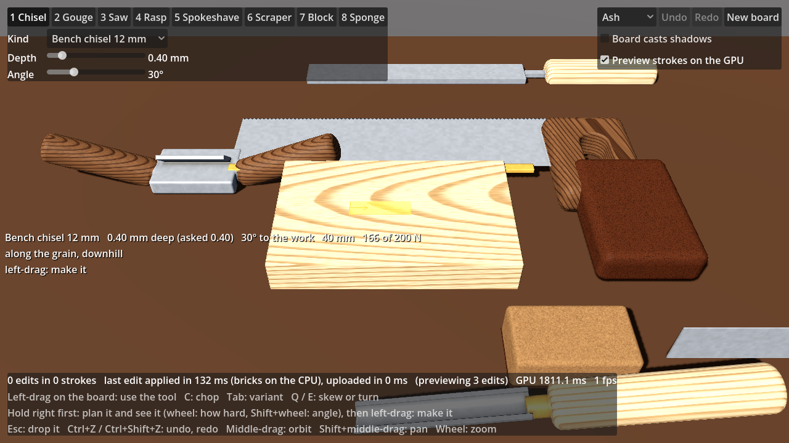 | 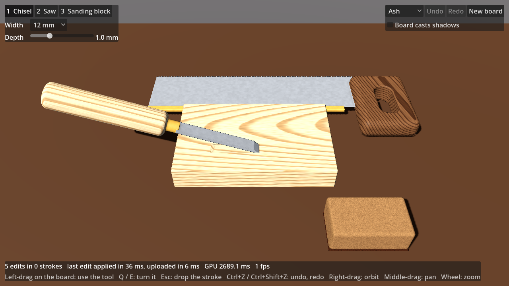 |
| 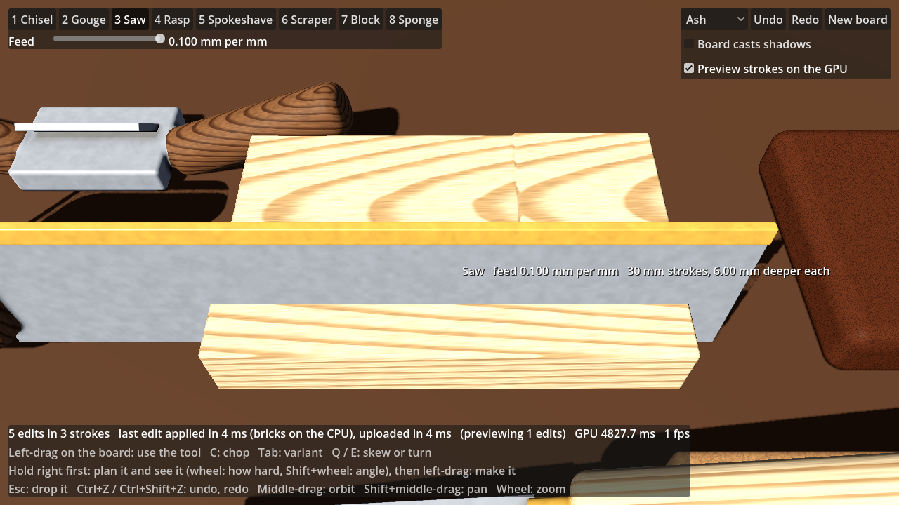 | 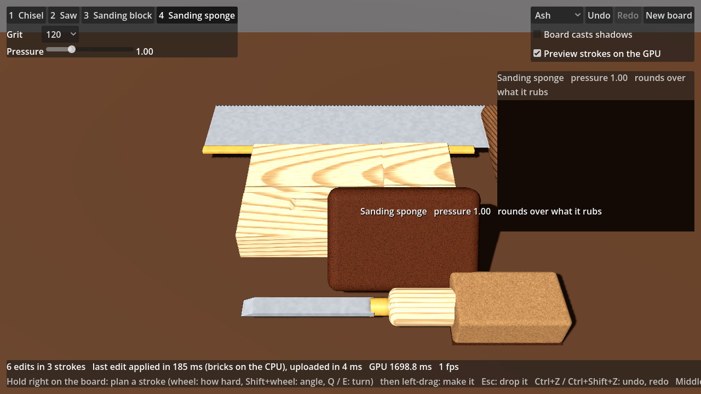 |
| 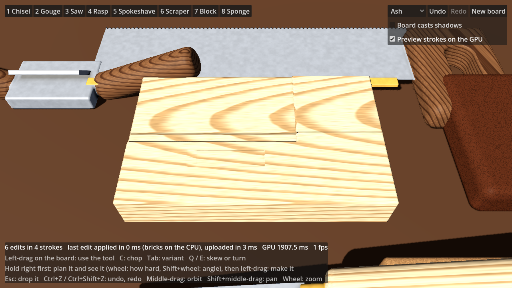 | |

(Rendered here on software OpenGL, at about a frame a second; the status line reads the
GPU time on real hardware.)

**How it works:**
- **Planning** (`SdfBody.plan_stroke`) engages the tool as a stroke would and moves it
  along the path a millimetre at a time. The cut it comes to goes into the shader's
  overlay (below) flagged as planned: the shader hatches the surface wherever a planned
  edit's boundary makes it. Acting carries out the same stroke, so what you see planned is
  what you get, as far as you drag it.
- **Without a plan** the same thing happens at once: a left-drag waits until the pointer
  has moved 2 mm, takes that as the stroke's direction, and `SdfBody.begin_stroke` plans
  a chisel's, gouge's or spokeshave's cut there and then (open-ended, as far as the drag
  goes) without drawing it. So a direct stroke cuts exactly as a planned one would, and
  its report is what the line by the pointer shows.
- **Hiding the tool.** The tool in hand is hidden until it acts. Then it fades in through
  a screen-door dither (`sdf_opacity`), which keeps its depth exact; shadow maps
  (orthographic) draw it whole.
- A tool in use is a *stroke* (`native/src/core/tools/`). It turns the tool's motion into
  edits of the same shapes the tool's model is built from, and gives the cut so far merged
  into as few edits as it takes: the chisel's ramp and flat run, the saw's kerf, the
  block's pass.
- **While the tool moves, the shader draws the stroke.** `SdfBody` hands the merged edits
  to the Live shader as uniforms (the *overlay*, up to 16 edits), and the shader cuts them
  into the field wherever it samples it: the march, the settling steps, the normals and
  the ambient occlusion. Moving a tool costs no CPU work at all, and the cut keeps up with
  the frame rate.
  - Tools only cut, and a cut only ever raises the field, so empty cells stay empty and are
    still skipped whole.
  - A cut applied on top of the field is exactly the body with that edit appended. Where it
    opens up a solid cell, which has no brick, the shader uses the cell's stored material.
  - Normals difference the cut as closely as an exact cell's tape, so its edges stay crisp.
    Bricks keep their taps half a voxel apart, because hardware filtering resolves only
    1/256 of a voxel.
- **When the tool lifts off, the stroke is applied once:** the merged edits, plus the
  chisel's lift-out, go to the body's `EditSession` (`native/src/core/edit/`). That session
  keeps unlimited undo and updates the octree and ADF incrementally; cells that pruning
  shows no changed edit reaches keep their bricks.
  - `SdfBody` applies it on a worker thread, then uploads only the brick layers that
    changed.
  - The stroke leaves the overlay in the same frame as that upload, so nothing pops.
  - Commands that arrive while an update runs are folded together, so a slow update never
    builds a backlog.
  - `game/tests/stroke_preview` renders each tool's preview and its commit and diffs them.
    The mean difference is under 0.1 / 255, and 0.013% of pixels or fewer differ
    noticeably.
- **With the preview off,** each move is applied as it happens. Cuts that only grow keep
  their newest piece open and re-cut just that as it grows. The chisel's 10 mm lengths of
  run and the saw's 1 mm slices of kerf are then left behind, so an update touches only
  what moved. Those pieces overlap generously: inside a union of cuts the field is only a
  bound, and a thin overlap leaves a seam whose value is smaller than the hit epsilon,
  which the raymarcher would draw as a wall. The merged edits have no such seams.

`sdf_bench tools` times both ways on the workshop board (4 shared cores), and the
refinement that follows once the tool is idle (see below):

| Tool at work | Applied as it moves | Previewed, applied on release | Refined when idle |
| --- | --- | --- | --- |
| chisel, 12 mm wide, 1.5 mm deep, pushed 60 mm | 29 updates of 1.9 ms (55 ms in all), 8 edits | 3.0 ms once, 3 edits | 55 ms |
| saw, 12 mm deep in 30 strokes | 30 updates of 3.4 ms (0.10 s), 10 edits | 4.8 ms once, 1 edit | 63 ms |
| sanding block, rubbed over the board | 25 updates of 8.2 ms (0.21 s), 1 edit | 8.8 ms once, 1 edit | 93 ms |
| sanding sponge along an arris, 3 passes of 60 mm | 30 updates of 23 ms (flow 12, octree and ADF 11), 1 layer | (not previewed) | |

Before the changes below, the same commits took 57, 70 and 95 ms, and a sponge update
48 ms. Applied as it moves, the cut lags the tool by an update. Previewed, the cut is there
in the same frame, and the CPU works once per stroke.

### Edits in milliseconds

Applying a cut costs little in itself. What cost the time was refining the creases a cut
makes (its rim, and its floor meeting its walls) down to 1 mm exact cells, eight children
at a time, re-sampling a thousand bricks or more.
- **Coarse first, refined when idle.** An edit stops refining creases at the largest bricks
  (`AdfParams::update_exact_cell`, 7 mm): they become exact cells at once. Exact cells
  evaluate their own tapes, so the surface is the same. Only drawing costs more there
  until `Adf::refine()` takes them down to 1 mm. `SdfBody` refines on its worker once the
  body is idle (no tool engaged, nothing queued: `refine_when_idle`); a new stroke simply
  waits for it. An edit that reaches creases refined earlier redoes them from their big
  cube, so cutting across old work costs no more than cutting a face.
- **Cuts fold into the old bricks.** When an edit only appends cuts (Subtract or
  Intersect), each brick it reaches applies them to the samples it already holds: one
  primitive per sample instead of the cell's whole tape. The usual checks at voxel centres
  catch whatever the cut does between samples (a new crease, a kerf thinner than a voxel)
  and send that cell down the full path. Bricks the cut leaves as they were keep their
  slots and are not uploaded again; the rest are rewritten in place.
- **Half the precision.** Bricks are refined to 10 µm (was 5 µm), and never finer than
  40 µm between samples (was 20 µm). The board takes 7,288 bricks instead of 13,320.
- **Smaller uploads.** Brick layers are 512² (512 bricks), so an edit re-sends a quarter
  as much per layer it touches.
- **Bricks on the GPU.** Where the renderer has a `RenderingDevice` (Forward+, Mobile),
  bricks are sampled by a compute shader (`native/src/godot/gpu_sampler.cpp`). It is built
  from the same primitive and blend includes as the Live shader, with a tape interpreter
  reading storage buffers. The ADF refines a level at a time, so each level's bricks are
  one dispatch: 512 corners and 343 voxel centres each. The CPU keeps only the decisions
  (split, exact cell, brick). Bricks whose tapes hold a smoothing layer (a grid only the
  CPU has) are sampled on the CPU alongside. `SdfBody.gpu_bricks` (on by default) turns it
  off; under Compatibility the CPU samples everything, as before.
  - `game/tests/gpu_bricks` (Forward+) checks that GPU-sampled bricks agree with
    CPU-sampled ones within 0.02 mm near the surface, after a build, after edits and once
    refined; on Mesa's lavapipe they agree within 0.0065 mm. It also prints build and
    refinement times, CPU against GPU. Only a real GPU makes those meaningful: lavapipe is
    the CPU again.

### Sanding as smoothing: a layer, not cuts

A cut is a shape; what a sponge or a sheet of sandpaper in the hand does is closer to
smoothing the surface it is rubbed over. So the sponge does not make edits of shapes at
all. It makes one *smoothing layer* (`native/src/core/body/layer.h`,
`native/src/core/tools/smoothing.h`): the field near the surface, re-sampled on a sparse
grid (0.25 mm) and evolved by curvature flow.
- **Curvature flow.** Where the sponge bears, every point moves inward at a speed set by
  the surface's curvature there, convex parts only: dphi/dt = |grad phi| max(kappa, 0).
  - An arris rounds over, with a radius growing as the square root of the rubbing.
  - Ridges left by other tools soften, while faces and hollows stay put.
  - Each update runs a few explicit steps on the grid near the sponge, in parallel.
- **The layer replaces the field instead of offsetting it.** Inside a sharp arris the field
  itself has a crease (along the bisector: F = -min(x, y)). Adding any smooth offset to F
  would keep that crease, as a ridge along the middle of every sanded edge.
  - So the layer stores the smoothed field phi and a weight w, both reconstructed as
    quadratic B-splines (C1, so normals stay smooth), and gives (1 - w) F + w phi.
  - Where w is 1, none of F's creases remain.
  - B-splines reproduce planes exactly, so flat faces under the sponge do not move by a
    micron.
- **It is one edit, `Op::Layer`, in the edit list like any other:**
  - undo takes it away;
  - later cuts apply over it;
  - a later sponge stroke smooths those.
  - Octree pruning drops it wherever its weight is 0, and bounds it by its samples
    elsewhere.
  - The ADF samples it into bricks like everything else. It never gives it an exact cell,
    because only the CPU holds the grid (the `EXACT` live source draws bodies without their
    layers).
- **Its gradient stays bounded (1.41 plus about 0.15), so rays keep taking safe steps.**
  - Level sets outside the surface move nearly with the surface beneath them (velocity
    extension, capped so the explicit steps stay stable).
  - Inside, each level moves by its own curvature, so levels only spread apart.
  - The bound is measured only down to 0.9 mm below the surface: rays approach from
    outside, and deeper only the field's sign matters.
- **Its rate** (T4-7): a flow of 0.05 / grit × pressure × 5740 / Janka mm² per millimetre of
  travel. Ten passes at 120 grit round an ash arris to about half a millimetre's radius
  (0.21 mm off along its bisector); 60 grit takes about 1.4 times as much off, 220 grit
  about three quarters (the radius grows as the square root of the rate). The demo and
  the flow's own tests rub at 16 times the real pace.
- **The sponge is applied as it goes.** The shader cannot draw a layer, so there is no
  preview. The worker runs the flow and re-samples only the region whose samples changed
  (`EditSession::revise_stroke` with a changed box). Moving the sponge only records its
  path.

| | |
| --- | --- |
| 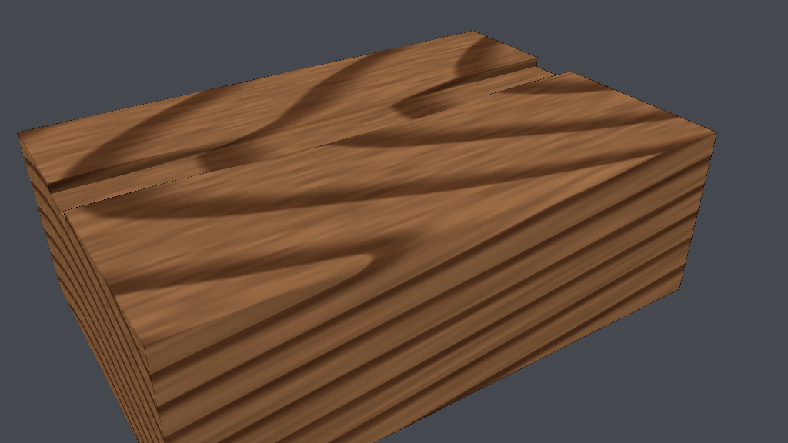 | 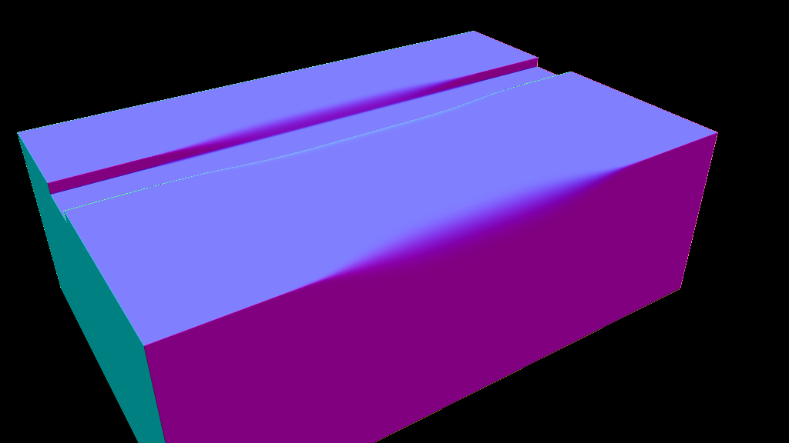 |

The "sanded" demo (`sdf_render sanded`, `load_demo("sanded")`): a sharp walnut block
with a chisel groove, sanded by two sponge strokes, one layer each. It is part of the
GPU/CPU parity set.

### Chisels and gouges cut as the wood lets them

A chisel is not a free cutter. How deep it goes depends on the force behind it, how it
meets the grain and whether the chip has somewhere to go. The workshop's chisels and
gouges follow the real tools (researched from woodworking references: see
[docs/PLAN.md](docs/PLAN.md), "Tools"). Every plan works this out against the board
before the stroke is made (`native/src/core/tools/cutting.h`), and the line by the
pointer says what it comes to.

- **Force.** A chip costs force in proportion to its cross-section, the wood's Janka
  hardness (ash 1320 lbf, oak 1290, walnut 1010) and how the edge meets the fibres:
  - least cutting along them;
  - about 1.8 times that across them;
  - 4.5 times severing them (end grain, or chopping across the grain).

  Each side of the chip still attached to the work adds a strip of shear. A hand pushes
  about 200 N, less on a flexible paring chisel. Where that is not enough, the cut stays
  shallower, and the plan shows exactly how shallow.
- **Clearance.** Held bevel down, an edge bites only when tipped at least 2° past its bevel.
  Held flatter in the middle of a face, it rides on the bevel and *skates*: nothing is cut.
  Tipped past, it dives at the difference until it levels at its depth. Diving steeply, it
  digs in. From an open face (the end of the board, an existing cut) the chip is free in
  front, and the cut goes in at full depth at once.
- **Grain.** The board's fibres rise out of its top face towards +x, as its figure shows.
  Pared that way (downhill) the split running ahead of the edge runs out to the surface,
  and the cut is clean. Pared the other way (uphill) it follows the fibres down, and tears
  out below the cut. Across the grain out of an edge, the unsupported fibres break away.
  Tear-out is seeded, so the plan and the stroke tear the same.
- **Gouges** keep their corners out of the wood, so the chip's sides are free: a #7 goes a
  millimetre deep in the middle of a face, where a flat chisel of its width stays at half
  that. Deeper than its sweep, a gouge's corners bury and its sides tear. A V-tool cutting
  across the grain tears on its uphill wing.
- **Chopping.** Press C, or tip the chisel past 60°. Each click is one mallet blow.
  - The blow drives a thin slit, 2.5 mm across the grain in oak for a 12 mm bench chisel.
    Along the grain it goes further and splits the wood. Each blow goes less far than the
    last.
  - It hollows nothing out. Within reach of an open face on its bevel side, the chip
    between pops off along the grain: chop near an edge, or chop a line and pare towards it.
  - A paring chisel is never struck: pushed by hand, it barely goes in.
- **Skew.** The guiding hand (left and right) or Q / E turn a chisel's edge across its
  push, and a skewed edge slices for less force.
- **What it cannot do.** The chip is everything between the floor and the surface above it,
  and the plan checks it every millimetre across the edge (nine columns), so no cut runs
  under the work:
  - Where the surface steps up by more than a millimetre within two (a raised part, a wall,
    the end of an earlier cut), the edge stops at its face: *blocked*. Chop it, or come
    from the other side. (Chopping, at 60° or more, still goes into walls.)
  - Where it rises more gently into a chip thicker than the hand can push, the edge follows
    it up, as a hand lowering the handle onto the bevel would, at up to 8°. Steeper, it
    *stalls*.
  - The blade's body never passes through the work. Points on its back and sides for 25 mm
    behind the edge are probed at its angle: wood there (an overhang, a ridge) stops it
    (*the blade meets the work*), and so do walls either side closer than the edge is wide
    (*too wide for the gap*: take a narrower chisel). A stroke the blade cannot reach is
    refused at its start.
  - The force is the chip's own section over the edge. In a gouge's channel that is the
    crescent the next pass takes, not a block up to the surface either side, so a gouge
    deepens its own channel pass after pass.
- **Depth that feels right.** A chisel is set 0.2 mm deep and a gouge 0.3 mm to begin with,
  at most 1.5 and 2.5 mm. Dived in steeply, the edge levels at the asked depth (a steep dive
  only warns *digs in*).
- **Splinters, not boxes.** Tear-out, breakout, buried corners and a V-tool's torn wing are
  splinters along the grain: each dips from its root, rounded, and curls back up to the
  surface, never deeper than half as much again as the cut (a millimetre at most; breakout
  two). They leave no square pits.

The variants (Tab cycles them; the panel lists them):

| Tool | Bevel | Force | Mallet | For |
| --- | --- | --- | --- | --- |
| Bench chisel 6, 12, 25 mm | 25–27° | 200 N | a bench chisel's blows | paring and light chopping |
| Paring chisel 25 mm | 20° | 160 N (it flexes) | never struck | fine paring |
| Mortise chisel 8 mm | 32° | 200 N | 1.5× a bench chisel's | chopping deep |
| Skew chisel 18 mm | 25°, edge at 30° | 200 N | light | slicing, into corners |
| Gouge #3 and #7, 12 mm | 22° | 180 N | light | smoothing (#3), scooping (#7) |
| Veiner #11 3 mm; V-tool 60° 6 mm | 22° | 180 N | light | lines and grooves |

`native/tests/test_cutting.cpp` holds the calibration (12 mm bench chisel by hand unless
noted):

| Case | Result |
| --- | --- |
| Ash, from the end, along the grain | 0.48 mm deep (1 mm asked) |
| Ash, from the side, across the grain | 0.25 mm |
| Walnut, from the end, along the grain | 0.61 mm |
| Middle of the face, held at 20° (bevel 27°) | skates: nothing |
| The same, tipped to 33° | dives at 6°, levels at 0.3 mm as asked |
| #7 gouge vs the chisel, mid-face, 1 mm asked | 1.00 mm vs 0.48 mm |
| Skewed 30°, 0.2 mm | 58 N instead of 83 |
| Oak, chop across the grain | 2.52 mm (a firm blow); the next blow 1.72 more |
| Oak, a tap, a firm blow, a heavy one | 0.75, 2.52, 4.03 mm |
| Oak, chop along the grain | 6.2 mm, and it splits |
| Mortise chisel 8 mm vs a bench chisel of 8 mm | 1.5× per blow |
| Paring chisel, chopped | 0.02 mm: never struck |
| Pared at a step 3 mm high | stops at its face (blocked, 3 mm); nothing cut under it |
| 12 mm chisel into an 8 mm groove; a 6 mm one | too wide, refused; the 6 mm pares its floor |
| Pared under a bar standing 2 mm clear | the blade meets it: stops 40–48 mm on |
| A surface rising 4.6°; one rising 24° | followed up (1.6 mm by 45 mm on); stalls where it begins |
| #7 gouge, 35°, 2 mm asked: two passes | 1.15 mm, then 0.66 mm more in its own channel |
| 6 mm chisel along that channel | blocked by its end (a wall sloping at the gouge's angle) |
| Tear-out (oak, uphill) and breakout | rounded: under 80% of their bounding box, within their depth limits |

The force behind the cutting constant: 0.005 N/mm² of chip per newton of Janka hardness
(`kCuttingResistance`), about 29 N/mm² paring ash along the grain. That is of the order
reported for orthogonal cutting of hardwoods at chip thicknesses of a few tenths of a
millimetre (tens of N/mm²).

**Working speed.** A tool in hand goes no faster than a hand works it, whatever the pointer
does (`workshop.gd`, `WORKING_SPEED`): dragged ahead, it follows; let go, the stroke ends
where it got to. As the force a cut takes nears what the hand can give, it slows, to a fifth
at the limit. The workshop's pace multiplies these.

| Tool | Free | At the hand's limit | Blows |
| --- | --- | --- | --- |
| Chisel | 40 mm/s | 8 mm/s | one every 0.35 s at most |
| Gouge | 30 mm/s | 6 mm/s | one every 0.35 s at most |
| Spokeshave | 40 mm/s | 8 mm/s | |

A 0.4 mm paring cut in ash (170 of 200 N) goes about 13 mm/s: 50 mm takes nearly 4 s.
While a chisel or gouge pares, loose pieces in its way (offcuts, islands) go on ahead of
its edge. Each physics step, a shape query with a box round the blade (30 mm behind the
edge, rising at its angle) finds the pieces it touches, and each moves on by the edge's
advance. So nothing is cut under. Shavings and chips are on their own physics layer, so
what the blade takes off is left alone. Two other ways were tried and failed at this scale
in Jolt:
- The blade as a solid kinematic body, a wedge under the piece's edge, slid under a 5 g
  piece, or tipped it and buried it 3 mm in the board.
- A plate standing up at the edge flung pieces off the board.

A push as fast as the edge (13 mm/s) is less than friction takes off a few grams in one
physics step, so pieces are moved with the edge, not given its velocity.

### Sanding block: a hard face, rubbed

`native/src/core/tools/rubbing.h` (shared with the rasps and the card scraper):
- **It is held flat to the work.** The hand holds a block flat to the face it is on: of the
  planes through three of 45 points under it (within 10° of the normal it was set with), it
  lies in the one most of them are on, to 5 µm. A normal from the pointer a degree or two off
  (four hits 4 mm apart, one on an earlier cut) is put right; a bump, a groove or the
  board's rounded end does not tip it; a rasp tilted on purpose stays tilted.
- **It rests on the high spots.** When the stroke starts, a height map of the surface under
  the plane is read from the work: rays every 2.5 mm over the board (about 2,500 on the
  workshop board, under a millisecond). Each piece of ground the block covers is cut
  below the highest point under it. So a bump goes first, and the ground round it is left
  alone until the bump is down to it. A hollow narrower than the block is never reached.
- **Only where it rubbed.** Where the block goes is kept as *patches*:
  - A patch is a rectangle lying along the way the block moves over it (turned to the
    motion after its first 5 mm).
  - It grows while the block works back and forth along one line, drifting across it by
    up to half the block. A diagonal sweep sands a diagonal band, not the rectangle round
    it.
  - Turning off the line, or reaching onto higher ground once it has cut, starts a new
    patch. The new patch rests on the ground as the patches before it left it, so strokes
    over the same ground add up.
  - Each patch is one cut. A stroke keeps at most 12 of them; beyond that, the two that
    make the most compact rectangle merge. The preview shows the newest if they are more
    than it holds.
- **How much:** each point loses the block's rate for every millimetre it travels while the
  point is under it:
  - depth = rate × pace × travel × min(1, the block's length along the way it goes / the
    range it covers) / contact;
  - contact is the share of the block's face bearing on the work: work within 0.02 mm of
    its floor, at least a tenth. The same hand's pressure on less wood cuts faster: a 6 mm
    edge sands about five times as fast as the board's face, and a bump about ten times.
- **The rate:** 1.2e-3 × pressure / grit × 5740 / Janka hardness (N) mm per mm of travel.
  That is 1e-5 mm at 120 grit in ash, about 0.2 mm in a minute of steady sanding; 80 grit
  takes 1.5 times that, 240 grit half. The panel offers grits 60 to 320, pressure in steps
  of 0.05, and a small pad (35 × 20 mm) besides the block (70 × 40).
- **The cut:** a box over the patch down to its floor, blended in with a feather of up to
  half the depth it takes off most of the ground under it. So the rim rises smoothly, and
  ground further below the floor (round a bump) is left alone, as a hard block leaves it.
- `native/tests/test_rubbing.cpp` checks each of these. `game/tests/tool_planning` rubs
  the board in the workshop and reads the line by the pointer.

### Rates and working speeds

Every tool takes wood off at the real tool's rate and goes no faster than a hand works it,
both times the workshop's *pace* (1× by default; ¼× to 8× on the panel). At 1× a real hand's
work takes real time: a minute's sanding takes a fifth of a millimetre, a saw cut through
the board seventy strokes. (docs/PLAN.md, T4.)

| Tool | Rate (ash, pressure 1) | Working speed | What stops it, and says so |
|---|---|---|---|
| chisel, gouge | as deep as a hand can push it (200 N) | 40, 30 mm/s; a fifth at the hand's limit | a step ahead, the blade meeting the work, a gap too narrow, a chip too thick |
| sanding block | 1e-5 mm per mm rubbed at 120 grit (0.01 mm a metre) | 300 mm/s | resting on high spots (the line shows its contact) |
| saw (a tenon saw, 8 teeth to the inch) | 0.0038 mm per mm pushed through a 25 mm chord of oak, × 25 / chord; nothing on the pull | 300 mm/s | its back, 59.5 mm below the highest wood under it (*its back meets the work*); through |
| rasp | 3.35e-4 mm per mm pushed for a cabinet rasp in oak (0.05 mm a 150 mm push), × coarseness / 0.5; nothing on the pull | 250 mm/s | resting on high spots (the line shows its contact) |
| card scraper | 0.01 mm of oak from each point its burr is pushed over; nothing on the pull | 200 mm/s | resting on high spots |
| spokeshave | as deep as two hands (250 N) push the chip's section, up to its mouth (0.8 mm) | 150 mm/s; a fifth at the hands' limit | a step ahead of its toe (*blocked*), a chip too much to push (*stalls*), its mouth |
| sanding sponge | a curvature flow of 0.05 / grit mm² per mm (ten passes at 120 grit round an ash arris to 0.5 mm radius) | 300 mm/s | (it only rounds: faces and hollows stay) |

The saw's rate is the hand's weight shared by the teeth in the wood: a chord of 10 mm or
less (a corner, a thin stick) goes 2.5 times as fast as 25 mm, a 100 mm chord a quarter as
fast. Through 25 mm of oak 50 mm wide it takes 68 strokes of 200 mm (a tenon saw takes
50–80). It reads the work along its line when it is set: every millimetre, a column's top
and bottom (two rays), for the chord at any depth and the highest wood under its back. A
set feed (`"feed"`, either way) remains for tests.

In the workshop the tool follows the pointer at its working speed: dragged ahead, it
follows; let go, the stroke ends where it got to. Whatever part of it meets the work (a
blade, a face, a card, a sole; not the saw's plate, which slides in its own kerf) pushes
loose pieces in its way aside.

### Shaping and finishing: rasps, a card scraper, a spokeshave

`native/src/core/tools/shaping.h`:
- **Rasps** (a coarse wood rasp, a cabinet rasp flat or round, a fine patternmaker's) take
  a tiny bite with each tooth on the push, so they never tear the grain.
  - A rasp's face is a rubbed face (`tools/rubbing.h`, as the sanding block's): stiff, it
    rests on the highest points under it and takes them down first, and it cuts only where
    its 200 mm face has been, faster where it bears on less (over the board's end, on an
    arris, on a raised strip).
  - It removes steadily, faster the coarser it is and the harder it is pressed, slower in
    harder wood: 6.7e-4 × coarseness × pressure × 5740 / Janka mm per mm pushed. A cabinet
    rasp takes 0.05 mm of oak in a 150 mm push with all its face bearing; on the workshop
    board, its face overhanging an end, about 0.02 mm in a 40 mm push.
  - The flat face lowers what it is rubbed over. Tilted about its line (the guiding hand's
    wheel) along an arris, it takes a chamfer off it, fast at first (it bears on the arris
    alone), then slower as the chamfer widens. The round face hollows.
- **The card scraper**, flexed and pushed, takes a whisper: 0.01 mm of oak from each point
  its burr passes over, however long the stroke (a rubbed face 1 mm along and 60 across,
  resting on what stands highest under it), feathered 4 mm at its sides. Nothing on the
  pull, and it cannot tear out. It is for cleaning up tear-out and tool marks.
- **The spokeshave** is a plane with a 40 mm sole.
  - It is held flat on the work (settled as a rubbed face is), and its sole rests on the
    lowest line lying on the surface under it, the highest across its blade: the surface
    itself where it is convex, bridging hollows shorter than the sole.
  - Its blade takes a shaving that far below: an even 0.1 mm on a flat face from its first
    millimetre (where a chisel has to dive in), following a curve, leaving a groove alone.
  - Two hands push it (250 N) through the chip's own section (columns across the blade, as
    a chisel's): 0.16 mm on the face of an oak board, 0.51 mm on a 20 mm edge; along the
    stroke a chip too much for them stalls it. Its mouth passes 0.8 mm at most (*its mouth
    passes no thicker a shaving*).
  - Its toe, half a sole ahead of the blade, stops at a rise of over a millimetre within two
    (*blocked*): the stroke ends half a sole short of the step.
  - Against the grain it tears out as a chisel does, at half the rate: its mouth keeps the
    split short.
- `native/tests/test_shaping.cpp` checks each of these, and `game/tests/tool_planning`
  makes a spokeshave pass and ten rasp strokes in the workshop.

### Pieces: sawn through, the board comes apart

Saw right through the board and the strip you cut off comes away. It is a body of its own,
resting on the bench, and still editable. Undo straight after puts the pieces back together.
Fracture and failing joints will split bodies the same way later
([docs/PLAN.md](docs/PLAN.md), "Pieces"); only what cuts them will differ.
- **Detecting it.** A saw stroke that has gone through reports its kerf's middle plane
  (`Stroke::separation`). After its commit, the worker checks the plane with
  `plane_clear` (`native/src/core/pieces/`). This is an adaptive quadtree over the plane
  within the body's bounds. A square is proven free of material when the field at its
  centre exceeds the Lipschitz bound times its half-diagonal; otherwise it splits, down to
  0.05 mm. If no material crosses the plane, the two sides cannot be joined: any path
  between them crosses it. On the board the check takes about 13 ms.
- **Measuring it.** The same worker then measures both sides from the ADF
  (`measure_sides`): volume, centre of volume and hull points, in about 30 ms more. It
  turns the plane so that the smaller side is in front, and `SdfBody` emits
  `separated(point, normal)`.
- **Splitting without waiting.** `SdfBody.split(point, normal)` returns a new body for the
  part in front of the plane and keeps the part behind it. It takes the worker's
  measurements and reads nothing else from the body, so it costs about 3 ms of the frame.
  It used to measure there and then wait for the pieces' rebuilds, which stalled the frame
  for about half a second.
  - Each piece appends an `Op::Intersect` with its half-space, as an undo step. The plane
    sits 5 µm into the kerf from the piece's own face, not in the kerf's middle. A plane
    in the middle would leave a kink in the field just outside each face (where the
    other face used to be), and the ADF would refine it along the whole face.
  - Until the half-space lands, the shader's overlay draws it: the same mechanism that
    previews strokes (W2a) cuts the other side away.
  - Both pieces draw the same textures until one of them uploads. That piece makes new
    textures, the one full upload a split costs; the other then updates its own in place.
    Brick textures are made a quarter larger than needed, so a brick pool that grows while
    refining seldom sends them whole again.
  - Nothing waits on a rebuild.
- **Physics.**
  - Each piece's mass (from its volume and the wood's density) and its centre of mass
    come from the worker's measurements.
  - Its rigid body sits at its centre of mass, because Godot's automatic one follows shape
    origins.
  - Its collider is a box when the piece fills at least 90% of its bounds, as a sawn
    strip does, and a convex hull otherwise. The hull's points are brick zero crossings,
    reduced to the extremes along 256 directions, then to the outermost of any within
    1 mm. Left as tight clusters round corners and edges, they made sliver faces the
    offcut rocked and sank on.
  - The offcut gets a 0.25 m/s nudge off the kerf. It is a piece of work like any other
    (a rigid body holding its `SdfBody`: it can be picked up, carried and put in the vise).
    The piece in the vise is frozen, with its own collider by the same rule, which for a
    board is a box: pieces sank 3 mm into its hull, whose points still bunch within a
    little over a millimetre at its eased corners. Its collider is rebuilt at the split,
    before the half-space lands, so the offcut never starts inside it.
- **The engine: Jolt, named.** `project.godot` names Jolt (`3d/physics_engine`). Until W5-5
  it was left at DEFAULT, which Godot 4.7 ran as GodotPhysics3D. So the Jolt tolerances
  below did nothing, and the figures this section gave for "Jolt" were GodotPhysics3D's.
  Under GodotPhysics3D, small light bodies never came to rest: a 4 mm chip, a shaving or a
  16 mm block rocked on the bench, gaining energy, spinning at up to hundreds of radians a
  second and digging millimetres into what they lay on (`game/tests/physics_calm`).
- **Millimetre tolerances.** Godot's physics engines are tuned for metre-sized objects:
  Jolt's defaults let contacts overlap by 2 cm. `project.godot` sets the overlap to 0.2 mm
  (`[physics]`), so a 25 mm offcut rests on the bench instead of sinking into it.
- **Falling and landing.**
  - Pieces and debris have continuous collision detection. Let go at a height or knocked
    off the bench, a piece moves further in a physics step than the bench top is thick;
    swept, it lands on it rather than ending up inside.
  - The floor's collider is a plane, which only ever pushes things up.
  - A tool pushing a loose piece moves it only as far as it is free to go (its shapes swept
    along the push, from just above what it rests on), never into the work, the bench or
    another piece.
- **Measured** (`game/tests/offcut_physics`, 1 s after the saw goes through).
  `tools/compare_physics.sh` repeats it under GodotPhysics3D, and under Box3D, Erin Catto's
  new engine, through the experimental
  [godot-box3d](https://github.com/bearlikelion/godot-box3d) extension (built from source,
  never committed; its figures are from before the room):

  | | Jolt, box | Jolt, hull | GodotPhysics3D, box | GodotPhysics3D, hull | Box3D, box | Box3D, hull |
  | --- | --- | --- | --- | --- | --- | --- |
  | sinks into the bench at rest | 0.00 mm | 0.63 mm (0.81 at worst) | 0.20 mm | 0.20 mm (3.9 at worst) | 0.09 mm | 0.16 mm (4.2 at worst) |
  | tilts | 0° | 2.3° | 0° | 0.4° | 0° | 0.7° |
  | slides off the kerf | 4.3 mm | 2.4 mm | 5.6 mm | 7.8 mm | 0.9 mm | 2.2 mm |

  A sawn strip gets the box (it fills its bounds). Jolt rests a hull less well than a box;
  irregular offcuts, which get hulls, are the ones to watch. Box3D's friction combines
  differently, hence its shorter slide. It is still alpha, as is its Godot extension.
- **Landing and lying still** (`game/tests/physics_calm`, under Jolt). Each of these goes at
  most 0.2 mm into what it rests on (2.6 mm at worst, landing), and is still within 0.7 s:
  - a chisel's shaving and a spokeshave's, on the board;
  - a shaving and a chip, off the bench onto the floor;
  - a sawn strip, on the bench;
  - a loose block, pushed off the board's end by the chisel and by the sanding block;
  - the strip, let go from carry height over the floor and over the bench.

  Before W5-5, the chisel's shaving lay inside the board (see *Shavings and chips*), and a
  chip and the pushed block went 43 and 62 mm into the floor and the bench and never came
  to rest.

### Islands: cuts meeting, no plane

Cuts that meet can free a piece no single plane separates: a rebate sawn off the end (one
cut down from the top, one in from the end), a corner cut off by two slots, a chip
chiselled free. That piece comes away too, and it rests where it lies.
- **Finding it** (`native/src/core/pieces/parts.h`). Once the board is idle after a commit,
  its worker looks round the cut for parts of the material that no longer hold together
  (`find_parts`). The ADF's inside samples are joined, in parallel within each brick, then
  across the faces between leaves (the octree face procedure):
  - plain bricks are trusted as drawn (a gap they would show has samples in it);
  - in exact leaves, where the brick strays from the field, the exact tape along the
    segment between two samples decides, so a slot a tenth of a millimetre wide still
    parts the board.

  If the material round the cut is one piece, nothing came away (the body was one piece
  before, and any path round the cut can go round inside the region). If a part lies
  wholly inside the region, it is the island: a chip is found this way in about 10 ms.
  Otherwise the region grows once to hold the smaller parts, then the whole board is
  looked at (about 35 ms for its 7,300 bricks).
- **Cutting it out, proved apart** (`cut_out`, `body/region.h`). The island is cut out by
  a *region*: an octree of cubes marked as the island's (its material and the air near
  it), the rest's, or free (air at least 0.05 mm clear of every surface, by the exact
  field). Cubes split where both sides' samples share one, and wherever an island cube
  meets a rest cube across a face that is not clear, down to 0.05 mm. When no island cube
  touches a rest cube, every path from one to the other crosses clear air: the island
  truly came away. If they still touch at the finest (a web too thin for the samples to
  see), nothing splits.
- **Keeping one side** (`Op::Keep`). Each side takes the region into its edit list as an
  undo step. Where it drops, the field becomes `max(d, 0.1 - d)`: at least 0.05 mm, so no
  surface is left and the octree takes those cells for empty. Kept and dropped cubes meet
  only across free ones, where that is just `d`, so the field stays continuous. The shader
  cannot evaluate a region (a sampled octree only the CPU holds), so tapes holding one
  never become exact leaves, and the island's body stays hidden until its region lands;
  the board shows the island until then.
- **Physics.** Where an island came out the board is hollowed, and one hull would fill the
  hollow, so the collider of the piece it came from becomes convex pieces: its bounds cut into boxes by the
  faces of each island's box (0.3 mm outside it), each box's piece the hull of the
  surface points and material in it. No piece reaches into an island's box. Two things
  the engine needed at millimetre scale:
  - shapes with a 0.1 mm margin (Godot's default of 4 cm rounds them away);
  - the island set down just into what is under it before it is let go, and let go
    asleep: a body's first step finds no contact yet (falling from a kerf's width above,
    it drops 2.7 mm into the surface), and on the few points of a sampled surface it
    would rock. Nothing under it, it falls.

  (A triangle mesh of the board's surface was tried first: the engine drops triangles of
  a millimetre or two as degenerate, and coarser ones misplace the surfaces round a
  rebate. Proper meshes come with the Bake step.)
- **Measured** (`game/tests/island_split`): the rebate, a 1,800 mm² interface, is found and
  cut out in about 600 ms on the worker (about 160,000 region cubes, most of the time);
  split in about 3.5 ms of the frame; it rests in the rebate, 1.1 mm down (its kerf) and
  none across. The island's own ADF costs about 1.7 times the bricks its surface had in the
  board's, where the region keeps its creases from becoming exact leaves.

### Shavings and chips: what the tools take off

A chisel's, gouge's or spokeshave's shaving curls up off the edge as the stroke goes, and
drops when it breaks or the stroke ends. Tear-out, breakout and a chop's pop-off throw
chips. They land, lie still for 2 s, fade out over half a second and are gone (from play:
lying about until swept, they only cluttered the bench). Undo straight after takes a
stroke's back. Debris never goes back into a body: it only shows what came off.
- **The report** (`native/src/core/tools/debris.h`). As a previewed stroke moves, it says
  what it took off since it last said, read from the body as it was before the stroke
  (the body is only changed when the stroke lands). A planned stroke samples its shaving
  every half millimetre, as the chip the edge actually takes. It looks at nine columns
  across the edge, from its section (rising to a gouge's corners) up to the surface
  over it. The shaving is as wide as the columns holding wood, as thick as their section
  over that width, and lies across the edge where that wood was. Pared half off the
  board, it is half as wide and on the board's side; over a groove under its middle it
  holds together, cut at its sides. It is within 0.1% of the wood the board lost
  (full-width) and 2.4% (half off the side). Each chip is reported once, when the
  edge reaches it: the material its cut takes beyond the floor's, sampled over its box.
  `SdfBody.take_debris()` hands it over in world space, coloured by the wood where it
  came from (`albedo_at`: the grain and rings run on into the shaving).
- **Breaking.** Cut along the fibres a shaving holds together; severing them it crumbles:
  it breaks every (1.5 + 3 (1 − split)) / grain mm, about 10 mm across the grain in ash,
  2.4 mm into end grain. It breaks too wherever the whole edge passes over air.
- **The curl** (`game/workshop/debris.gd`). The shaving rides up the blade's back and
  curls over, tighter the thinner it is (a radius of 1.5 mm + 12 times its thickness,
  winding in a thickness a turn so the turns never meet). It comes off 0.7 as long and
  1 / 0.7 as thick as the cut (the same wood, compressed along the cut). Drawn as a ribbon
  with the wood's colours, each cross-section as wide as its sample and across the edge
  where its wood was, rebuilt as it grows (at most about 0.5 ms a frame).
- **Physics.** Released, a shaving is a rigid body whose collider is the box round the
  curl in its own frame: a hull round the curl rocked from facet to facet and never came
  to rest. It weighs at least a few grams to the solver (lighter bodies this small are
  shaken about), and is damped (light and springy, it soon lies still).
- **Born clear, resting on the work.** A shaving is made where it curls, lifted clear of the
  cut, and a chip is lifted out of the face it broke from.
  - Only a *loose* piece it is born inside (one the blade was pushing ahead of the edge) is
    one it goes through.
  - The piece in the vise it rests on. From W5-2 to W5-5 the vise's frozen rigid body
    counted as loose, so shavings fell through the board onto the bench, inside it.
  - Where it would still start inside something (the work's collider is its bounds, over
    a cut's floor), it is set down on it from above, just touching.
- **Fading.** A piece is at rest once it has moved slower than 5 mm/s for 0.2 s (or 3 s
  after it came away, still rolling or not). 2 s later it is frozen, its collider is
  switched off so nothing lands on it, and its own copy of its material fades from opaque
  to clear over 0.5 s. Then it is freed. The newest 24 pieces move; older ones fade (frozen
  solid, they hung in the air once what they lay on was carried off); past 60, the oldest
  go. A piece put in the vise fades away the debris lying where it goes.
| | |
| --- | --- |
| 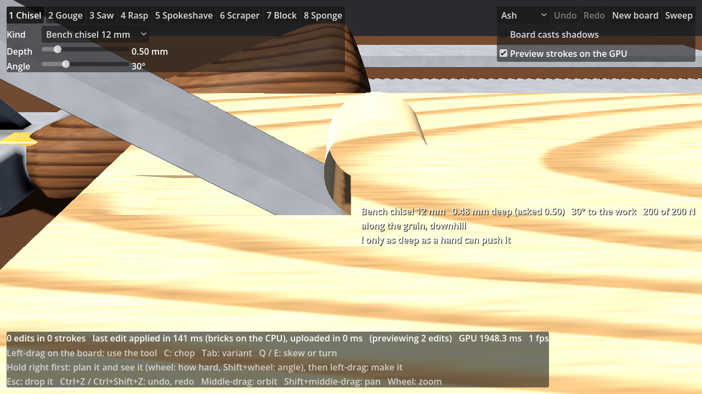 | 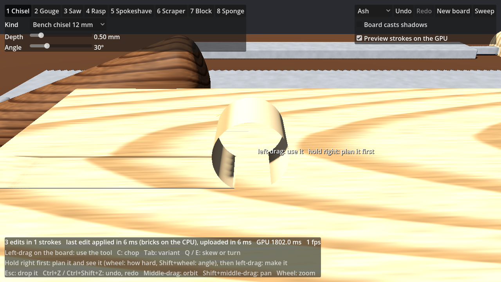 |

- **Measured** (`native/tests/test_debris.cpp`, `game/tests/debris`): a paring cut's
  shaving is within 1% of the volume the board lost (sampled by columns, before and
  after); the shaving and the tear-out chips of an uphill cut in oak together, within 1%;
  in the workshop, a 50 mm paring cut 0.5 mm deep gives a 255 mm³ shaving (the board lost
  248), at rest on the board within a second, faded and gone under 3 s after it came
  away.

### Dust

The saw, the rasps, the scraper and the sanding tools throw dust: a puff of grains of the
wood that fly, land and are gone within about a second. What reaches the ground (the bench
or the floor) heaps up in a pile there, one solid mound: sawdust piles up on the bench
beyond the kerf's ends. Dust landing on the board just goes. (From play: 30,000 grains
lying about, on the board's face too, was clutter.) Undo takes a stroke's dust back, piles
included; *Sweep* clears the piles.
- **How much** (each stroke's `debris()`, from the body before the stroke):
  - **The saw:** each slice of kerf it goes down through is the kerf's width times the
    material along the blade's line at that depth (sampled every millimetre, kept per half
    millimetre of depth). It leaves at that chord's two ends.
  - **The rasps and the scraper:** their pass's section (a round face's grows as it goes
    in) times the length its face covered, as far as that is over material (probed every
    5 mm or so, once for each cut).
  - **The sanding block:** what its patches' floors take off the surface as mapped when
    the stroke began (where they overlap, the lowest floor).
  - **The sponge:** its own flow measures what it moves out of the material. That runs on
    the worker, so the last of it arrives just after the stroke ends.
- **The grains** (`game/workshop/dust.gd`, one MultiMesh):
  - A puff throws up to 16 grains of 0.2–0.9 mm by tool, bigger when there is more wood
    (dust takes 2.5 times the room the wood did) up to 2.5 mm across, 15% paler than the
    wood. Thrown a way (out of a kerf's end), a grain leaves 1.5 mm out, clear of the edge.
  - Where a grain lands is found once, when it is thrown: its arc is cast in three pieces
    against the physics space (bench, floor, the piece in the vise, pieces lying about).
    Meeting a steep face (the board's side) it drops straight down it.
  - Landed, it shrinks away over 0.3 s. At most 3,000 are drawn at once (more fly unseen);
    at most 20 are thrown a frame.
- **The piles.** A grain that lands on a body marked `"ground"` (the bench, the floor)
  adds its wood to the nearest pile within 25 mm (or within the pile), else starts one.
  - A pile is one mesh: a mound of profile (1 − r²)², as high as half its radius (flanks
    of about 37° at the steepest, sawdust's angle of repose), holding 2.5 times its wood.
  - It stands at the mean of where its dust landed, in the mean of its dust's colours.
  - It keeps its wood per undo step, so undo takes a stroke's share back.
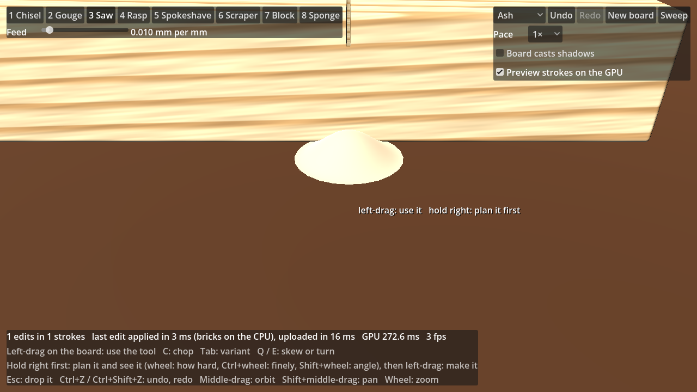

- **Measured** (`native/tests/test_debris.cpp`, `game/tests/dust`):
  - against what the board lost: saw 0.1%, sanding block 0.4%, rasps 0.7–0.8% (flat and
    half-round), sponge 1.0%;
  - in the workshop, a kerf 5.7 mm deep across the board gives 455 mm³ of sawdust (its
    width × depth × the board's width: 456), all of it in two piles on the bench, one
    beyond each end of the kerf, 5.1 mm high; the sanding block's dust lands on the face
    and goes (none piles);
  - throwing costs about 0.2 ms a frame while dust comes (0.3 ms at most); the grains up to
    2 ms a frame while a sanding block at many times the real pace throws thousands.

## Layout

| Path | What it is |
| --- | --- |
| `native/src/core/shared/*.glsl` | The SDF formulas — primitives, tool cross-sections, swept strokes, blend modes, materials. Written in a subset that compiles **both as C++ and as Godot shader code**, so the CPU evaluator and the GPU raymarcher run the same maths. Edit these only. |
| `native/src/core/glsl_compat.h` | Just enough GLSL (`vec3`, `mix`, `clamp`, …) in C++ to compile the shared files. |
| `native/src/core/body/` | `Body`, `Edit`, `Primitive`: the per-part source of truth, bounds and Lipschitz bounds; smoothing layers (`layer.h`); the material table. |
| `native/src/core/compile/` | The octree: per-cell pruned edit lists ("tapes") that keep per-query cost independent of edit count. |
| `native/src/core/adf/` | The adaptive distance field: the Live display cache (sampled bricks, exact cells at creases). |
| `native/src/core/eval/` | The CPU reference renderer (ground truth for every later GPU path) and exact ray queries. |
| `native/src/core/tools/` | The hand tools: each one's model and the cuts it makes, strokes that turn a tool's motion into edits, and the curvature flow that builds a sanding sponge's smoothing layer (`smoothing.h`). |
| `native/src/core/pieces/` | Bodies that come apart: whether a cut left two parts (`plane_clear`), and each piece's bounds, volume, centre of mass and hull points. |
| `native/src/core/edit/` | `EditSession`: a body's edits with the stroke in progress and undo / redo, its octree and ADF kept up to date incrementally. |
| `native/src/demo/`, `native/tools/` | Demo scenes; `sdf_gallery` (renders the galleries), `sdf_render` (renders any demo, diffs against another image) and `sdf_bench` (octree scaling). |
| `native/src/godot/` | The GDExtension: `SdfBody`, a node that raymarches a body live, and the GPU brick sampler. |
| `native/tests/` | Property tests for the core and golden-image tests. No Godot needed. |
| `game/` | The Godot 4.7 project. `game/workshop/` is the workshop (the main scene: `room.gd` the room, `player.gd` the first-person player, `workshop.gd` the pieces, the vise and the tools at the bench, `workshop_ui.gd` the hotbar and panels); `game/shaders/sdf/` holds byte-identical copies of the shared files plus `sdf_live.gdshader`; `game/bench/` the decision-gate benchmark. |
| `extern/godot-cpp/` | godot-cpp 10.0.0 (submodule), built against the Godot 4.7 API. |
| `tools/` | `sync_shaders.sh`, `run.sh` (headless / Xvfb scene runner, OpenGL or Vulkan), `test_godot.sh`, `parity.sh`, `compare_physics.sh` (Jolt vs Box3D on a sawn offcut). |
| `docs/PLAN.md` | The plan: principles, what is done, and the roadmap from here. The first plan is archived in `docs/archive/plan-v1.md`. |

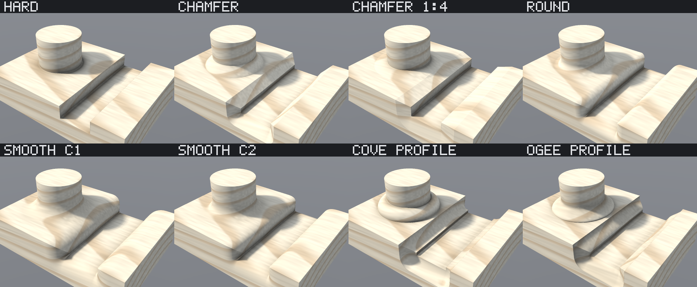

## Blend modes

The primitive decides the surface; the blend mode decides the edge where two surfaces meet.
Every mode has compact support — beyond its radius it is exactly the hard result — so an
edit only reshapes the field near its own primitive.

| Mode | Edge | Lipschitz |
| --- | --- | --- |
| `Hard` | crisp arris | 1 |
| `Chamfer` | flat bevel, optionally asymmetric (`r` onto one surface, `r2` onto the other) | √2 |
| `Round` | circular fillet, unchanged outside it | √2 |
| `Smooth`, `SmoothC2` | organic polynomial blend (C1 / C2); mixes materials | 1 |
| `Profile` | router-style edge profiles: arc concave, arc convex, ogee | √2 |

Operators: union, subtract, intersect, plus engrave / groove / tongue along a guide
surface, and paint (material only). Tool strokes sweep a flat, V or gouge cross-section
along a segment or a quadratic Bezier.

## Materials

Materials are evaluated in each part's own space, relative to where it sat in the log or
block, so a cut reveals the figure that was always inside it. Smooth blends mix materials;
hard ones keep a crisp boundary on one continuous surface.

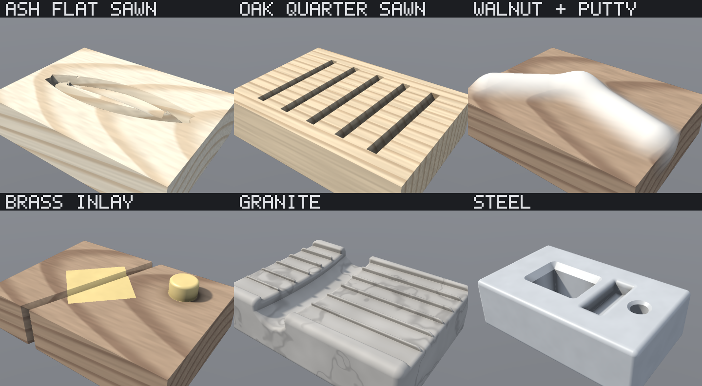

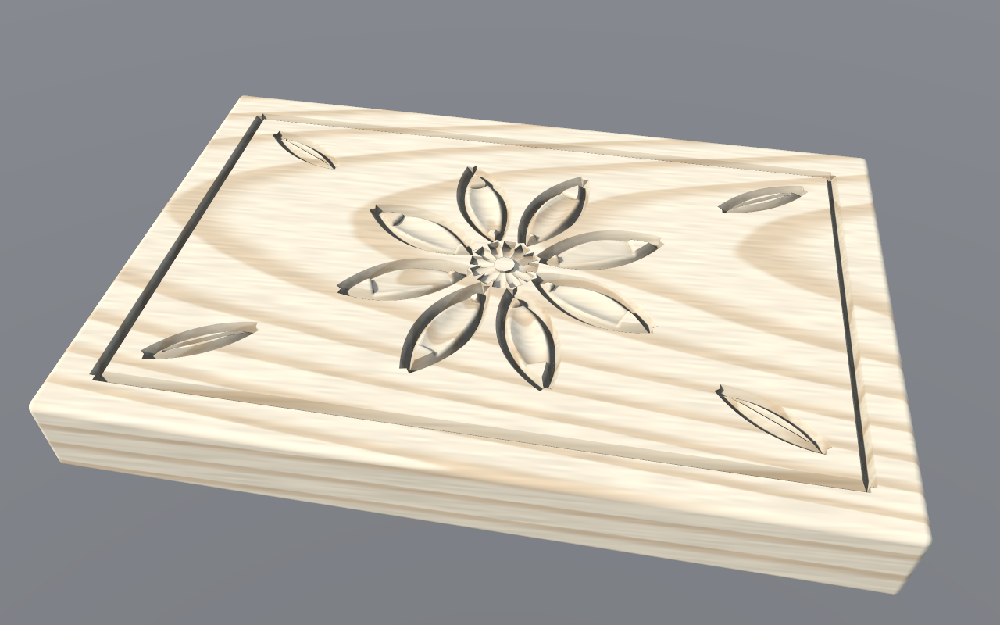

These are rendered by the CPU reference renderer (`native/src/core/eval`): sphere tracing
with Lipschitz-scaled steps and a pixel-footprint hit epsilon, SDF soft shadows and SDF
ambient occlusion. It is slow on purpose — it is the ground truth the GPU path is
diffed against. `Body::sample` already skips, per point, every edit whose bounding box
is at least `|d| + influence` away, which provably never changes the result's sign.

## Scaling to many edits: the octree

A carving session is thousands of strokes; a stone job, tens of thousands of chips.
Evaluating every edit at every point would make each query cost O(edits). Each body is
therefore compiled into an adaptive octree whose cells hold a pruned **tape**: only the
edits that can shape the surface inside that cell, in order.

**The contract:** inside every cell, a tape's field has exactly the body's sign, and its
exact values within `value_margin` (1 mm) of the surface — enough for hits, normals and
shadows. Further out it is a valid distance bound for that cell, so tracing clamps every
step at the cell's exit and skips cells proven empty.

Edits are dropped from a cell by rules that each preserve that contract:

- **Reach.** Its bounds, grown by its own blend reach, by the widest reach of any *later*
  edit that reads values in the cell, and by the value margin, miss the cell. (Hard min /
  max only depend on their operands' signs, but a later blend reads actual values, which a
  dropped neighbour could otherwise have fed.)
- **Interval arithmetic.** The field's range over the cell is tracked through every op's
  own rules. An edit that provably changes nothing is dropped; one whose primitive alone
  defines the whole cell *resets* the tape — unless an earlier union or paint put a
  different material there, which a cut must still expose.
- **Supersession.** A hard cut provably contained, throughout the cell, by a later hard
  cut is dead: finishing cuts supersede roughing cuts. Monotone blends in between widen the
  margin the later cut must win by; profiles, guide ops and material changes stop the search.

Cells split while their tape exceeds a budget, but never below half the smallest feature
in the tape: chipped stone does not need the sub-millimetre cells a fine V-tool line does.
Curved strokes tighter than their tool can follow are refused by `Body::add` — they are
not cuts a real tool makes, and their distance bound degrades too far.

`sdf_bench`, a granite block roughed out by percussive chips (4 cores):

| Chips | Build | Add one chip | Surface cells | Mean tape | Memory | vs full edit list |
| --- | --- | --- | --- | --- | --- | --- |
| 1,000 | 0.003 s | 7 µs | 820 | 4.3 | < 1 MB | 75× faster |
| 10,000 | 0.16 s | 30 µs | 55 k | 7.6 | 3.5 MB | 380× faster |
| 100,000 | 10.7 s | 1.0 ms | 1.0 M | 14.7 | 183 MB | 965× faster |

The 100k case is heavy mostly because a 0.4 m² worked face at millimetre detail simply has
that many cells; consolidating old chips into a sampled base field (planned alongside
forging) is what will bound it for very long jobs.

## In Godot: the Live path

`SdfBody` (a `MeshInstance3D`) compiles its body into the octree and an **adaptive distance
field** (ADF, below), and flattens both into data textures. A proxy box around the body
runs the Live shader (`sdf_live.gdshaderinc`), which sphere-traces each pixel in the body's
own millimetres. It writes the true hit's depth, normal and position (`DEPTH`, `NORMAL`,
`LIGHT_VERTEX`), so Godot lights and composites it like any mesh. Adding a stroke updates
the touched cells and bricks and uploads only what changed; nothing is meshed.

**The ADF.** Interpreting edit tapes per pixel costs the tape's length in texel fetches on
every frame, for edits that never change. So each edit is evaluated once per affected
voxel instead, when it is made:
- The octree continues into bricks of 8³ half-float distance samples along the surface.
- Each cell is refined until trilinear reconstruction is within 10 µm of the exact field
  near the surface. Planes are exact under trilinear filtering, so flat and gently curved
  faces get coarse bricks (up to 1 mm between samples).
- Creases would need ever finer bricks, so a crease cell ≤ 1 mm becomes an *exact* cell
  (≤ 7 mm right after an edit, until it is refined: see "Edits in milliseconds"). Rays
  march on its brick while they are further from the surface than the brick's error band,
  then evaluate its own tape: the octree tape pruned again to that small cell, which leaves
  only the 2–3 edits forming the crease. Hits, normals and materials there are exact. The
  band is measured when the cell is built (twice the worst brick-vs-tape difference near
  the surface), some 30× narrower than the worst case L · voxel · √3, so rays reach the
  tape later and need fewer tape steps.
- Lookups start from a 64³ grid over the root cube that names each block's node, a few
  levels above its leaves, instead of descending a dozen levels from the root.
- Normals come from the hit's own leaf: four taps on its brick, or one pass over its tape
  for all four taps in an exact cell. The tape interpreter is inlined wherever the shader
  calls it, so it is called from three places only.
- Bricks live in a `Texture2DArray` (512² layers of 512 bricks) and are read with hardware
  filtering. An edit
  re-samples the cells it reaches, reuses the rest (slots and all) and uploads only the
  layers that changed. "Reaches" is decided by pruning, not by the edit's bounding box: a
  long curved stroke's box holds several times more cells than its groove touches.
- The exact field stays the truth: bricks are a display cache, like a baked mesh.
  `live_source = EXACT` raymarches the tapes alone, for comparison.

`sdf_bench adf` (4 shared cores; per stroke before W4, at 5 µm and refined in full at
once, in parentheses):

| Body | Edits | Build | Memory | Exact cells | Per stroke |
| --- | --- | --- | --- | --- | --- |
| carved panel | 52 | 0.55 s | 16 MB | 4,616 | 6.9 ms (28) |
| fluted ball | 6 | 0.05 s | 3.0 MB | 0 | 2.2 ms (6) |
| random session | 227 | 2.5 s | 29 MB | 14,025 | 23 ms (51) |
| random session | 1,495 | 15 s | 50 MB | 22,516 | 60 ms (182) |

Nearly all of that is evaluating primitives at brick samples (callgrind: 80%), a quarter
of it in the Bézier strokes' cubic solve.

The shader is bound by texture fetches, as Claybook's SDF tracer was. `sdf_bench count`
replays it on the CPU for the benchmark's views and counts texel fetches per pixel:

| View | Exact tapes (E3b) | ADF (E3d) | ADF, measured bands and grid (E3e) |
| --- | --- | --- | --- |
| panel filling the screen | ~1070 | 129 | 64 |
| close-up of the rosette | ~1670 | 262 | 128 |
| 2000 random strokes | ~15,000 | 765 | 335 |

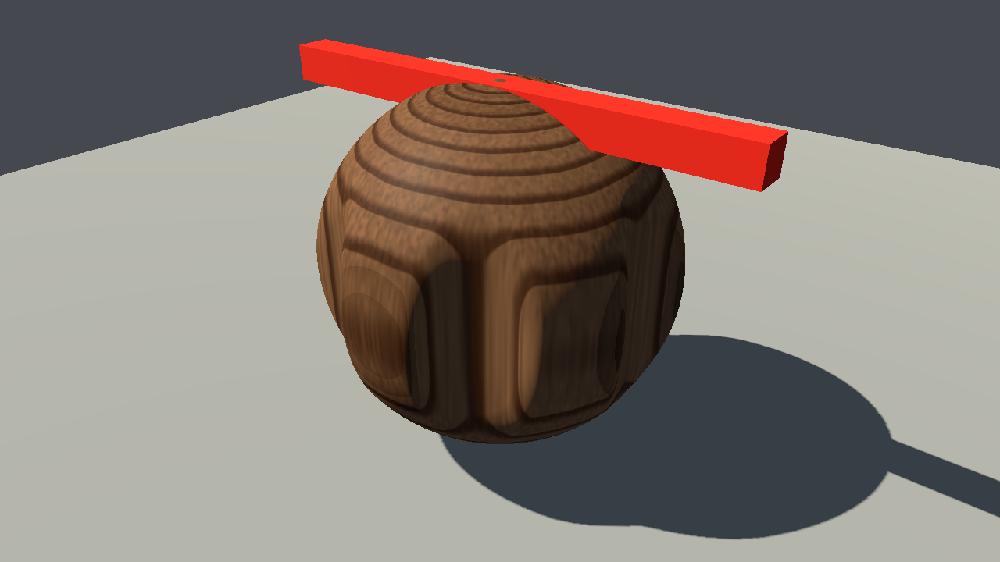

**Parity.** `tools/parity.sh` renders every demo through Godot and diffs it pixel by pixel,
from the same camera, against two CPU renders:
- the formula field (every edit, in order, no octree): the ground truth;
- the CPU tracing the same source (the ADF), the same algorithm, so any mismatch is a
  shader bug.

Normals check geometry and unlit albedo checks materials. The 27 cases are the 8 blend
modes, 6 material scenes, the carved panel, the fluted ball, a 300-stroke session and the
sanded block (smoothing layers), at 1280x720.
- **Against the ground truth:** the mean channel difference is at most 0.34 / 255, and at
  most 0.16% of pixels differ by more than 24 / 255. Those are single pixels on silhouettes
  and creases, where a pixel centre falls on one side of the edge or the other.
- **Against the CPU ADF:** at most 0.007% of pixels differ.

The exact Live path (`PARITY_ARGS=--live-source=exact`) matched the ground truth within
0.23 / 255 and 0.05%. It skips the sanded block: it draws bodies without their layers. Results are identical with the node scaled to a metre world
(scale 0.001).

What was checked in Godot (Compatibility renderer, the only one without a GPU):

| Check | Result |
| --- | --- |
| Depth composition with meshes | exact: meshes pushed into a body are cut at its surface |
| Casting shadows | works: the shadow pass runs the raymarch and takes its depth (opt-in, see below) |
| Receiving shadows | Forward+ / Mobile look shadows up per fragment at `LIGHT_VERTEX` (from Godot's source, to confirm on hardware); Compatibility computes shadow coordinates per vertex, on the proxy box, so there Live bodies receive no shadow-map shadows |
| Orthographic cameras (directional shadow passes are orthographic) | works |
| Metre-scaled world | works, parity unchanged |

**The decision gate** (plan §4) runs `game/bench/live_bench.tscn` on real hardware. The
first run (RTX 3060 Ti, Forward+, 1280x720) failed it clearly:

| Scenario | GPU median | Target (at 1080p) |
| --- | --- | --- |
| panel filling the screen | 19.1 ms | 6 ms |
| close-up of the rosette | 40.7 ms | 6 ms |
| 2000 random strokes | 283.9 ms | 6 ms |
| three bodies | 21.6 ms | 8 ms |

Where the time went (counted by replaying the shader on the CPU, and timed with Mesa):
- raymarching again in every shadow pass: about two thirds of the frame;
- Forward+ running the shader twice (depth prepass and colour pass);
- evaluations after the hit (refine, normal, AO): about 75% of the rest;
- about 8 texel fetches per edit in each evaluation.

The measured times track the fetch count (close-up ≈ 1.6× the panel's, 2000 strokes ≈ 14×).

What changed:
- Live bodies no longer cast shadows by raymarching unless `live_shadows` is on; the
  baked mesh (E4) will cast them. When they do, the caster marches bricks only: a shadow
  map cannot resolve an exact cell's error band.
- They draw in one pass (`sdf_live_single.gdshader`: the transparent pipeline, which skips
  the depth prepass but still writes depth). This also fixed speckle on Forward+: after its
  prepass, Forward+ redraws opaque materials with an exact-equality depth test, and a
  raymarched depth recomputed by a separately compiled shader variant misses it on some
  pixels. With `live_shadows` on, an internal shadows-only child runs the opaque variant
  in shadow passes, where no such test applies.
- The ray and the post-hit taps stay in their octree cell.
- Rays end at the opaque scene's depth (read in the single pass), so the parts of a body
  hidden behind meshes cost nothing.
- Edit, node and tape records are packed tighter.

Parity is unchanged. On Mesa that is 5.5× faster, and rendering 3D at half resolution
another 3.4×. The ADF (above) then removed the tape-length term from the per-pixel cost.

Run it after building (below):

```sh
godot --path game res://bench/live_bench.tscn                                   # Forward+
godot --path game --rendering-method gl_compatibility res://bench/live_bench.tscn
```

Use a 1920x1080 window if the screen allows. The switches after `--` show where time goes:
`--shadows=off`, `--live-shadows=on`, `--live-source=exact`, `--exact=off` (the ADF's crease
cells shade from their bricks, to measure what their tapes cost), `--ao=off`, and
`--scale3d=0.5` for half-resolution 3D. `--view=steps` shows step-count heat maps, and `--shots=<dir>`
saves each scenario.

## Building and testing

The core has no dependencies; the tests and the image tools need zlib (for PNGs), and the
Godot extension needs the godot-cpp submodule. The first build compiles godot-cpp's
bindings, which takes a few minutes; `-DSDF_BUILD_GODOT=OFF` skips the extension.

```sh
git submodule update --init
cmake -S native -B native/build -G Ninja
cmake --build native/build        # also writes game/bin/sdf_godot.<os>.<ext>
native/build/sdf_tests            # property tests (exactness, compact support, Lipschitz
                                  # bounds, no phantom surfaces, material weights, culling)
                                  # and golden images of the demo scenes
native/build/sdf_gallery out 2 2  # re-render the gallery images at 2x, 2x2 supersampled

GODOT=/path/to/godot tools/test_godot.sh        # headless tier: the Godot-side logic
GODOT=/path/to/godot tools/test_godot.sh --gpu  # GPU tier: renders, images, parity
GODOT=/path/to/godot tools/run.sh --vulkan res://tests/gpu_bricks.tscn   # GPU vs CPU bricks,
                                           # with build and refinement times
native/build/sdf_render carved_panel out/panel.png --view normals   # any demo, any view
```

The Godot tests come in two tiers:
- **Headless** (`tools/test_godot.sh`, about a minute on a CPU):
  - the extension loads;
  - the workshop's tools cut and undo;
  - stroke previews commit as previewed;
  - planned and direct strokes;
  - offcuts and islands come away and settle;
  - shavings and chips come away as much wood as the board lost, and settle;
  - sawdust is the kerf taken and heaps up; sanding dust lies on the face;
  - the workshop walked and worked in (`walk_and_carry`): the hotbar, walking, carrying,
    the vise squaring what goes in it, a board from the rack worked at the bench and
    carried away with its cut.

  One frame is rendered in software to check that the Live shader and the shared includes
  compile in Godot's pipeline. Nothing judges pixels. Without a GPU, this is the tier to run.
- **GPU** (`tools/test_godot.sh --gpu`): everything that looks at images:
  - live renders;
  - the workshop and planning drives with screenshots in `out/`;
  - stroke previews compared with their commits image by image;
  - GPU/CPU parity (`tools/parity.sh`);
  - with a Vulkan driver, GPU brick sampling (Forward+).

  It needs xvfb-run. It runs on Mesa's software drivers too, but at about 2 s a frame on
  llvmpipe that takes around half an hour.

After editing anything in `native/src/core/shared/`, run `tools/sync_shaders.sh`; the
test suite fails if the Godot copies drift. After an intended visual change, rewrite the
golden images with `SDF_UPDATE_GOLDEN=1 native/build/sdf_tests golden` — and look at them
before committing. The goldens are bit-identical across GCC and Clang, optimised or not,
on x86-64; the tolerances are there for MSVC and ARM.
